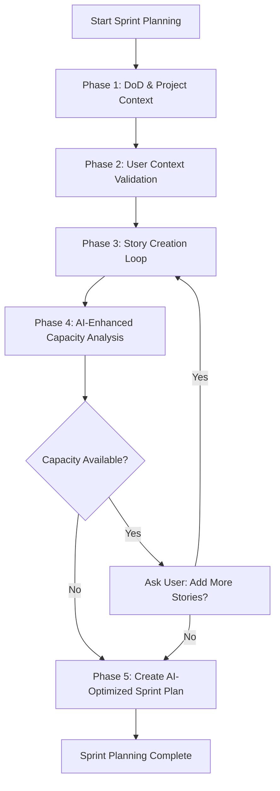

# Sprint Planning Task

## Purpose
Execute complete sprint planning workflow optimized for AI/Vibe coding environments including comprehensive AI context validation, story creation with AI-informed estimation, capacity analysis with AI productivity multipliers, and comprehensive sprint plan creation that maximizes AI coding effectiveness.

## Workflow Overview



## ⚠️ MANDATORY: Comprehensive User Context Validation (EXECUTE FIRST)

**❌ CRITICAL RULE**: Do NOT proceed without complete user context validation including AI-specific assessment.

### **Streamlined AI Context Questionnaire:**
```
🚀 AI-OPTIMIZED SPRINT PLANNING - CONTEXT VALIDATION

Quick context check for AI-enhanced sprint planning:

👥 TEAM & SKILLS:
- Team size/roles? (e.g., "2 full-stack, 1 mobile dev")
- Tech stack experience? (Beginner/Intermediate/Expert)
- Project domain familiarity? (New/Some/Experienced)

🤖 AI TOOLS & OPTIMIZATION:
- Primary AI tools? (Cursor/Copilot/Other/Multiple)
- AI tool performance in your environment? (Excellent/Good/Needs optimization)
- Expected AI code generation? (50%/70%/80%+)
- AI workflow preferences? (AI-first/Collaborative/Context-heavy)

⚡ CAPACITY & TIMELINE:
- Project time allocation? (25%/50%/75%/100%)
- Sprint duration preference? (1 week/2 weeks)
- Any time constraints or deadlines?
- Historical AI productivity gains? (3x/4x/5x/Unknown)

🎯 SPRINT FOCUS:
- Primary objective? (MVP/Feature completion/Foundation/Production)
- Quality requirements? (MVP speed/Production ready/Balanced)
- Testing approach? (Comprehensive/Standard/Minimal)

🔧 ENVIRONMENT:
- Development setup complete? (Yes/Partial/No)
- External dependencies status? (Ready/In-progress/Blocked)
- AI tool performance? (Excellent/Good/Needs optimization)

Please provide brief answers - I'll ask for details if needed.
```

### **Context Validation Requirements:**
- **Wait for Complete Responses** - Do not make assumptions about AI capabilities
- **Validate AI Tool Understanding** - Confirm specific tools and proficiency levels
- **Document AI Context** - Record for use throughout AI-enhanced sprint planning
- **Identify AI Gaps** - Request clarification for AI-specific information
- **Confirm AI Workflow Optimization** - Verify code generation → review → integration process
- **Validate AI Collaboration Patterns** - Ensure team AI-human task distribution is clear

## Phase 1: DoD & Project Context Validation

### **AI-Enhanced DoD Check:**
- Verify `docs/definition-of-done.md` exists and is current
- **Add AI-Specific DoD Criteria** if missing:
  - AI-generated code reviewed by human
  - AI prompts documented for complex logic
  - Performance tested (AI code efficiency validation)
  - AI context management strategy followed
- Confirm quality standards align with AI coding practices
- Document any AI-specific quality customizations needed

### **Project Context Validation:**
- **📋 Essential Documentation Review:**
  - `docs/index.md` - Project overview and scope understanding
  - `docs/tech-stack.md` - AI tool compatibility and suitability assessment  
  - `docs/project-structure.md` - Development complexity and capacity factors
  - Available Epic files (`docs/epic-*.md`) - Story pipeline and priorities
  - Existing stories (`docs/stories/`) - Historical velocity and estimation reference

- **🎯 Context Integration:**
  - Use tech stack info for AI suitability matrix
  - Reference project structure for capacity calculations
  - Review epic priorities for story selection
  - Analyze completed stories for AI productivity patterns
  - Confirm AI tool setup and context management strategy
  - Validate quality gates for AI-generated code


## Phase 3: Story Creation with AI-Informed Context

### **AI-Enhanced Story Creation Loop:**
```
FOR EACH story needed for sprint:
1. Identify next logical story from epic
2. Assess AI suitability for story type
3. Create story with AI-informed estimation:
   - Base complexity assessment
   - AI suitability analysis (High/Medium/Low)
   - Team AI experience adjustments
   - AI tool productivity multipliers
   - Human oversight requirements
4. Generate AI-appropriate technical guidance
5. Structure tasks for AI-human collaboration
6. Add to sprint backlog with AI annotations
```

### **AI-Informed Estimation Matrix:**
```
Story Type                | AI Multiplier | Human Oversight | Risk Factor | AI Suitability
------------------------ | ------------- | --------------- | ----------- | --------------
UI Development (Forms)    | 4-5x          | Low            | Low         | Excellent
CRUD Operations          | 5-6x          | Low            | Low         | Excellent  
API Integration          | 3-4x          | Medium         | Low         | Good
Business Logic (Simple)  | 2-3x          | Medium         | Medium      | Good
State Management         | 2.5x          | Medium         | Medium      | Good
Testing (Unit/Widget)    | 4x            | Low            | Low         | Excellent
Documentation           | 5x            | Low            | Low         | Excellent
Performance Optimization | 1.5x          | High           | High        | Fair
Complex Algorithms      | 1.2-1.8x      | High           | High        | Fair
Legacy Integration      | 1x            | High           | High        | Poor
Security Implementation | 1.5x          | High           | High        | Fair
```

### **AI-Optimized Estimation:**
- **Base Complexity**: Technical difficulty independent of team
- **AI Suitability Factor**: Apply matrix multiplier based on story type
- **AI Tool Optimization Adjustments**:
  - Multiple AI Tools: 1.2x multiplier (tool synergy)
  - Single Optimized Tool: 1.0x multiplier (baseline)
  - Tool Performance Issues: 0.8x multiplier (performance impact)
- **Environmental Factors**: Account for AI tool performance, context management efficiency
- **Quality Requirements**: Adjust for AI code review and optimization requirements

## Phase 4: AI-Enhanced Capacity Analysis & Story Loop

### **Advanced AI Capacity Calculation:**
```
Individual_AI_Capacity = Base_Individual_Capacity × 
                        AI_Tool_Multiplier × 
                        AI_Tool_Optimization_Factor × 
                        Project_AI_Suitability × 
                        AI_Performance_Factor × 
                        Context_Management_Efficiency

Team_AI_Capacity = Sum(Individual_AI_Capacity)
Sprint_Capacity = Team_AI_Capacity × Availability_% × Sprint_Duration
Available_Capacity = Sprint_Capacity × 0.90 (10% buffer for integration and optimization)
```

### **AI-Specific Capacity Factors:**
- **AI_Tool_Multiplier**: Cursor(4x), Copilot(3x), Multiple tools(4.5x)
- **AI_Tool_Optimization_Factor**: Multiple Tools(1.2x), Single Optimized(1.0x), Performance Issues(0.8x)
- **Project_AI_Suitability**: Excellent(1.2x), Good(1.0x), Fair(0.8x), Poor(0.6x)
- **AI_Performance_Factor**: Excellent(1.1x), Good(1.0x), Needs optimization(0.9x)
- **Context_Management_Efficiency**: Optimized(1.1x), Standard(1.0x), Basic(0.9x)

### **Enhanced Capacity Check Dialog:**
```
📊 AI-ENHANCED CAPACITY ANALYSIS

Team Base Capacity (Traditional): [X] SP
AI Productivity Assessment:
├── UI/CRUD Stories: [A] SP × [4-5x] = [Enhanced] SP  
├── Business Logic: [B] SP × [2-3x] = [Enhanced] SP
├── Complex/Legacy: [C] SP × [1-1.5x] = [Enhanced] SP
└── Total AI-Enhanced: [Y] SP

Current Stories: [Z] SP
Available Capacity: [Y] SP  
Remaining Capacity: [Y-Z] SP

AI Suitability Breakdown:
✅ AI-Excellent stories: [Count] ([X]% of sprint)
🟡 AI-Good stories: [Count] ([Y]% of sprint)  
🔴 AI-Challenging stories: [Count] ([Z]% of sprint)

Recommendations:
- Sprint is [Balanced/AI-Heavy/Human-Heavy]
- Consider [more AI-friendly/more complex] stories for balance
- Plan [enhanced/standard] code review for AI stories

You have [Y-Z] story points of remaining capacity.
Would you like to add more stories to the sprint?
- Yes: I'll identify next logical story with AI suitability analysis
- No: Proceed with current AI-optimized story mix to sprint planning

What would you prefer?
```

## Phase 5: Create AI-Optimized Sprint Plan

### **AI-Enhanced Sprint Plan Creation:**
Load `bmad-agent/templates/sprint-planning-tmpl.md` and populate with:

#### **Team & AI Context Data:**
- Team composition with validated AI proficiency
- AI-enhanced capacity calculations with detailed reasoning
- AI tools usage patterns and proficiency levels
- AI-specific quality standards and DoD customizations

#### **AI-Informed Story Breakdown:**
- All created stories with AI suitability ratings
- AI-enhanced estimates with methodology explanation
- Task assignments optimized for AI-human collaboration
- Dependencies and AI-specific integration points
- AI optimization strategies and productivity enhancement plans

#### **AI-Optimized Parallel Development Strategy:**
- Work streams designed for AI coding patterns
- AI context sharing and management schedule
- Integration points considering AI-generated code review
- Daily assignments balancing AI and human tasks
- AI tools coordination and optimization strategies

#### **AI-Optimized Timeline & Milestones:**
- Gantt chart with AI productivity assumptions
- Integration milestones with AI code review points
- Daily work assignments with AI-human task mix
- Buffer time allocation for AI context optimization
- AI productivity improvement milestones

### **AI-Enhanced Sprint Plan File Creation:**
Create `docs/sprints/sprint-[sprint-number]-plan.md` with:
- Complete team and AI context documentation
- All stories with AI-informed estimates and suitability ratings
- AI-optimized timeline and assignments
- AI-specific optimization strategies
- AI coding success criteria and metrics

## Enhanced Deliverables

### **Complete AI-Optimized Sprint Planning Outputs:**
1. **AI-Enhanced DoD** - Quality standards including AI code requirements
2. **Comprehensive Team & AI Context** - Complete validated context with AI proficiency
3. **AI-Informed Sprint Stories** - Stories with AI suitability ratings and estimates
4. **AI-Enhanced Capacity Analysis** - Realistic capacity with AI productivity factors
5. **AI-Optimized Sprint Plan** - Complete plan maximizing AI coding effectiveness

### **AI-Specific File Artifacts:**
- `docs/stories/[epic].[story].story.md` - Stories with AI suitability annotations
- `docs/sprints/sprint-[sprint-number]-plan.md` - AI-optimized sprint plan

## AI-Specific Success Criteria

### **AI Process Success:**
- ✅ Complete AI context gathered and validated
- ✅ AI tool readiness confirmed for all team members
- ✅ Stories created with accurate AI-informed estimates
- ✅ AI suitability assessed for all sprint stories
- ✅ Realistic AI-enhanced capacity analysis completed
- ✅ AI-optimized sprint plan created with productivity enhancements

### **AI Outcome Success:**
- ✅ Sprint plan leverages AI tools for maximum productivity
- ✅ Story estimates reflect actual AI capabilities and team proficiency
- ✅ AI-human collaboration patterns clearly defined
- ✅ AI-specific risks identified and mitigated
- ✅ Team confident in AI-enhanced sprint execution