# Sprint Planning Template

## Pre-Planning Validation (MANDATORY)
**✅ USER CONTEXT CONFIRMED:**
- [ ] Team composition, roles, skills, availability
- [ ] AI tool setup and optimization validated
- [ ] Specific stories/epics to prioritize
- [ ] Sprint goal and business value objective
- [ ] Constraints, deadlines, dependencies
- [ ] AI-enhanced capacity calculations completed
- [ ] Quality requirements and AI-specific DoD considerations

## Project Overview
**Project**: [Project Name]  
**Sprint**: [Number] | **Duration**: [Weeks] | **Goal**: [Sprint Objective]  
**Team**: [Size] members | **Start**: [Date] | **End**: [Date]  
**Scrum Master**: [Name] | **Product Owner**: [Name]

## Team Capacity & AI Optimization
| Role | Member | Base Capacity | AI Tools | AI Tool Setup | AI Multiplier | AI-Enhanced Capacity | Availability | Notes |
|------|--------|---------------|----------|---------------|---------------|---------------------|--------------|-------|
| [Role] | [Name] | [X] SP | [Tools] | [Optimized/Standard/Issues] | [Multiplier] | [Enhanced] SP | [%] | [Notes] |
| **Total** | **[N] people** | **[Base] SP** | | | **[Avg]x** | **[Total] SP** | **[Avg]%** | |

**AI-Enhanced Capacity Planning:**
- Base Capacity (Traditional): [X] SP
- AI Productivity Multipliers Applied: [Details]
- AI-Enhanced Capacity: [Y] SP
- Sustainable Target: [Y] SP (90% of AI-enhanced)
- Buffer Allocation: [Z] SP (10% for integration & optimization)
- Technical Debt: [W] SP (10-15%)

**AI Suitability Breakdown:**
- ✅ AI-Excellent Stories: [X] SP ([%] of sprint)
- 🟡 AI-Good Stories: [Y] SP ([%] of sprint)
- 🔴 AI-Challenging Stories: [Z] SP ([%] of sprint)

## 📋 AI-Optimized Sprint Backlog

### **Core Sprint Stories**
| P | ID | Story Title | Story File | Assignee | SP | Complexity | Risk | Status | Dependencies |
|---|---|---|---|---|---|---|---|---|---|
| 1 | [ID] | [Story Title] | `docs/stories/[id].story.md` | [Name] | [SP] | [High/Med/Low] | [High/Med/Low] | [Draft/Approved/InProgress/Review/Done] | [Deps] |

### **Additional Scope (Enhanced Capacity)**

| Priority | Category | SP | Description |
|---|---|---|---|
| 1 | [Category] | [SP] | [Description of enhancement work] |

### **Story File Management:**
- **Location**: All stories located in `docs/stories/`
- **Naming Convention**: `{epic_number}.{story_number}.story.md`
- **Status Tracking**: The `Status` column in the table above is the single source of truth. The status flow is: `Draft` -> `Approved` -> `InProgress` -> `Review` -> `Done`.
- **Story Details**: Full details for each story (like Acceptance Criteria) are in its corresponding `.md` file.

## 📅 Sprint Timeline - Gantt Chart

```mermaid
gantt
    title Sprint [Number] - [Sprint Goal] AI-Enhanced Timeline
    dateFormat  X
    axisFormat Day %d
    
    section [Team Member 1]
    [AI Story/Task 1]           :active, tm1s1, 0, 2
    [AI Story/Task 2]           :tm1s2, 2, 4
    
    section [Team Member 2]
    [AI Story/Task 1]           :active, tm2s1, 0, 2
    [AI Story/Task 2]           :tm2s2, 2, 5
    
    section Milestones
    Milestone 1        :milestone, m1, 2, 0d
    Milestone 2        :crit, m2, 6, 0d
```

## 🚀 Daily Work Assignment & Coordination Plan
| Day | [Team Member 1] | [Team Member 2] | Daily Focus | Integration Activities |
|-----|-----------------|-----------------|-------------|------------------------|
| **1** | [Story ID] - Task | [Story ID] - Task | Sprint kickoff, AI context setup | Initial code structure |
| **2** | [Story ID] - Task | [Story ID] - Task | AI-accelerated development | Daily code sync |
| **...** | ... | ... | ... | ... |
| **10**| Sprint review | Sprint review | Sprint review & AI retro | Sprint Complete |

## ⚠️ **Risk Assessment & Mitigation**

### **Critical Dependencies:**
- [Dependency 1]: [Impact] - [Mitigation]
- [Dependency 2]: [Impact] - [Mitigation]

### **Key Risks:**
- [Risk 1]: [Probability/Impact] - [Mitigation]
- [Risk 2]: [Probability/Impact] - [Mitigation]

## ✅ AI-Enhanced Definition of Done
**Story-Level AI DoD:**
- [ ] All acceptance criteria met
- [ ] AI-generated code reviewed by human
- [ ] AI prompts documented for complex logic
- [ ] Tests written and passing (AI-assisted)
- [ ] Documentation updated (AI-generated where appropriate)
- [ ] Integration tested with AI code validation
- [ ] Performance criteria met (AI code efficiency validated)
- [ ] AI context management strategy followed

**Sprint-Level AI DoD:**
- [ ] Sprint goal [X]% achieved with AI productivity gains
- [ ] All story files in `docs/stories/` have Status: Complete
- [ ] All stories meet AI-enhanced DoD
- [ ] Demo ready with AI productivity showcase
- [ ] Technical debt addressed (including AI code quality)
- [ ] No regression issues from AI-generated code
- [ ] AI productivity metrics documented
- [ ] AI lessons learned captured
- [ ] Story file workflow properly followed (Draft→Approved→InProgress→Review→Complete)

## AI-Enhanced Success Metrics
- **AI Velocity**: Target [Y] SP completed (AI-enhanced)
- **AI Productivity Gain**: [Y-X] SP improvement ([%] gain over traditional)
- **AI Quality**: Zero critical bugs from AI code, AI DoD compliance
- **AI Utilization**: 85%+ AI-enhanced capacity utilization
- **AI Parallel Efficiency**: >70% concurrent AI-optimized work time
- **AI Team Satisfaction**: High engagement with AI tools and collaboration
- **AI Learning**: Measurable improvement in team AI proficiency

## AI-Enhanced Retrospective Focus
**Key AI Questions:**
- What enabled effective AI-enhanced parallel development?
- How well did AI integration points and context management work?
- What AI workflow improvements are needed?
- How can we optimize AI tool utilization and team AI proficiency?
- What AI productivity patterns emerged?
- How effective were AI code review processes?
- What AI learning opportunities should we pursue?