# Sprint Planning Template

## Pre-Planning Validation (MANDATORY)
**✅ USER CONTEXT CONFIRMED:**
- [ ] Team composition, roles, skills, availability
- [ ] AI tool setup and optimization validated
- [ ] Specific stories/epics to prioritize
- [ ] Sprint goal and business value objective
- [ ] Constraints, deadlines, dependencies
- [ ] AI-enhanced capacity calculations completed
- [ ] Quality requirements and AI-specific DoD considerations

## Project Overview
**Project**: [Project Name]  
**Sprint**: [Number] | **Duration**: [Weeks] | **Goal**: [Sprint Objective]  
**Team**: [Size] members | **Start**: [Date] | **End**: [Date]  
**Scrum Master**: [Name] | **Product Owner**: [Name]

## Team Capacity & AI Optimization
| Role | Member | Base Capacity | AI Tools | AI Tool Setup | AI Multiplier | AI-Enhanced Capacity | Availability | Notes |
|------|--------|---------------|----------|---------------|---------------|---------------------|--------------|-------|
| [Role] | [Name] | [X] SP | [Tools] | [Optimized/Standard/Issues] | [Multiplier] | [Enhanced] SP | [%] | [Notes] |
| **Total** | **[N] people** | **[Base] SP** | | | **[Avg]x** | **[Total] SP** | **[Avg]%** | |

**AI-Enhanced Capacity Planning:**
- Base Capacity (Traditional): [X] SP
- AI Productivity Multipliers Applied: [Details]
- AI-Enhanced Capacity: [Y] SP
- Sustainable Target: [Y] SP (90% of AI-enhanced)
- Buffer Allocation: [Z] SP (10% for integration & optimization)
- Technical Debt: [W] SP (10-15%)

**AI Suitability Breakdown:**
- ✅ AI-Excellent Stories: [X] SP ([%] of sprint)
- 🟡 AI-Good Stories: [Y] SP ([%] of sprint)
- 🔴 AI-Challenging Stories: [Z] SP ([%] of sprint)

## AI-Optimized Sprint Backlog
| Story ID | Title | Epic | Base Est | AI Suitability | AI Multiplier | AI-Enhanced Est | Assignee | Priority | Dependencies | Stream |
|----------|-------|------|----------|----------------|---------------|-----------------|----------|----------|--------------|--------|
| [ID] | [Title] | [Epic] | [X] SP | [Excellent/Good/Fair/Poor] | [Multiplier] | [Y] SP | [Name] | [High/Med/Low] | [Deps] | [A/B/C] |

**AI-Enhanced Summary:**
- **Total Planned (AI-Enhanced)**: [Y] SP
- **AI Productivity Gain**: [Y-X] SP ([%] improvement)
- **Parallel Streams**: [N] concurrent work streams optimized for AI coding
- **AI Integration Points**: Days [X, Y, Z] - AI context refresh & code review
- **Human Oversight Required**: [Z] SP ([%] of sprint)

## Parallel Development Strategy

### Work Stream Architecture
**Stream A - [Focus Area]**: [Description of work stream]
- **Lead**: [Team Member Name]
- **Stories**: [Story IDs]
- **Dependencies**: [Internal/External dependencies]
- **Integration Points**: Day [X], Day [Y]

**Stream B - [Focus Area]**: [Description of work stream]
- **Lead**: [Team Member Name]
- **Stories**: [Story IDs]
- **Dependencies**: [Internal/External dependencies]
- **Integration Points**: Day [X], Day [Y]

**Stream C - [Focus Area]**: [Description of work stream]
- **Lead**: [Team Member Name]
- **Stories**: [Story IDs]
- **Dependencies**: [Internal/External dependencies]
- **Integration Points**: Day [X], Day [Y]

### AI-Optimized Coordination Strategy
- **Daily Standups**: [Time] - Focus on AI productivity, blockers, and integration needs
- **AI Context Syncs**: [Days/Times] - AI context sharing and management
- **Integration Syncs**: [Days/Times] - Cross-stream coordination with AI code review
- **Communication Channels**: [Tools/Slack channels] + AI prompt sharing
- **AI Code Integration**: [Branch strategy optimized for AI-generated code]
- **AI Quality Gates**: [AI code review process and human oversight points]
- **Conflict Resolution**: [Process for resolving AI coding and integration blockers]

### AI-Enhanced Integration Plan
- **Day [X]**: [First AI integration milestone - AI-generated code review & merge]
- **Day [Y]**: [Mid-sprint AI integration - AI productivity check & feature validation]
- **Day [Z]**: [Final AI integration - AI code quality validation & demo prep]
- **AI Context Refresh**: Days [A, B, C] - Maintain AI context throughout sprint
- **AI Quality Checkpoints**: Days [D, E, F] - Human oversight and AI code validation

## Sprint Timeline & Gantt Chart

### AI-Optimized Visual Timeline

```mermaid
gantt
    title Sprint [Number] - [Sprint Goal] AI-Enhanced Timeline
    dateFormat  X
    axisFormat Day %d
    
    section [Team Member 1] - Multi-Tool Setup
    [AI Story/Task 1]           :active, tm1s1, 0, 2
    [AI Story/Task 2]           :tm1s2, 2, 4
    [AI Integration Work]       :tm1int, 4, 6
    [AI Story/Task 3]           :tm1s3, 6, 8
    [AI Demo Prep]              :tm1demo, 8, 10
    
    section [Team Member 2] - Optimized Setup
    [AI Story/Task 1]           :active, tm2s1, 0, 2
    [AI Story/Task 2]           :tm2s2, 2, 5
    [AI Integration Support]    :tm2int, 5, 7
    [AI Final Testing]          :tm2test, 7, 10
    
    section [Team Member 3] - Standard Setup
    [AI Story/Task 1]           :active, tm3s1, 0, 3
    [AI Story/Task 2]           :tm3s2, 3, 6
    [AI Integration & Polish]   :tm3polish, 6, 10
    
    section AI Integration Milestones
    AI Context Setup            :milestone, ai1, 0, 0d
    Stream A AI Complete        :milestone, m1, 2, 0d
    AI Context Refresh          :crit, ai2, 4, 0d
    Mid-Sprint AI Integration   :crit, m2, 6, 0d
    AI Quality Check            :milestone, ai3, 8, 0d
    AI Demo Ready               :milestone, m4, 10, 0d
```

### AI-Enhanced Daily Work Assignment Plan
| Day | [Team Member 1] - Multi-Tool | [Team Member 2] - Optimized | [Team Member 3] - Standard | Daily Focus | AI Activities | Integration Activities |
|-----|------------------------------|------------------------------|----------------------------|-------------|---------------|----------------------|
| **1** | [AI-optimized task/story] | [AI-optimized task/story] | [AI-optimized task/story] | Sprint kickoff, AI context setup | AI tool setup, context initialization | Initial code structure |
| **2** | [AI-optimized task/story] | [AI-optimized task/story] | [AI-optimized task/story] | AI-accelerated development | AI productivity optimization | Daily code sync |
| **3** | [AI-optimized task/story] | [AI-optimized task/story] | [AI-optimized task/story] | Stream A AI completion | AI code review & validation | **Stream A AI Integration** |
| **4** | [AI-optimized task/story] | [AI-optimized task/story] | [AI-optimized task/story] | AI parallel development | AI context refresh | Cross-stream testing |
| **5** | [AI integration work] | [AI integration work] | [AI integration work] | Mid-sprint AI review | **AI Context Refresh** | **Major AI Integration Point** |
| **6** | [AI-optimized task/story] | [AI-optimized task/story] | [AI-optimized task/story] | AI feature development | AI productivity check | Integration testing |
| **7** | [AI-optimized task/story] | [AI-optimized task/story] | [AI-optimized task/story] | AI feature completion | AI quality validation | **Feature Complete Check** |
| **8** | [AI testing/Polish] | [AI testing/Polish] | [AI testing/Polish] | AI quality assurance | AI code quality check | System testing |
| **9** | [AI demo prep] | [AI demo prep] | [AI demo prep] | AI demo preparation | AI productivity metrics | **Final AI Integration** |
| **10** | [Sprint review] | [Sprint review] | [Sprint review] | Sprint review & AI retro | AI lessons learned | **Sprint Complete** |

### Detailed Daily Assignments
**Day 1 - AI-Enhanced Sprint Kickoff:**
- [Team Member 1] (Multi-Tool): [AI-optimized story/task with AI suitability: Excellent]
- [Team Member 2] (Optimized): [AI-optimized story/task with AI suitability: Excellent]  
- [Team Member 3] (Standard): [AI-optimized story/task with AI suitability: Good]
- **Team**: Environment setup, AI context initialization, branch creation, AI workflow standup

**Day 2 - AI-Accelerated Development:**
- [Team Member 1] (Multi-Tool): [AI-optimized story/task with 4.5x productivity]
- [Team Member 2] (Optimized): [AI-optimized story/task with 4x productivity]
- [Team Member 3] (Standard): [AI-optimized story/task with 3x productivity]
- **Team**: Daily AI standup, AI productivity review, context sharing

**Day 3 - First AI Integration:**
- [Team Member 1] (AI Expert): [Complete AI story X, AI code review preparation]
- [Team Member 2] (AI Intermediate): [AI-assisted story/task with human oversight]
- [Team Member 3] (AI Beginner): [AI-assisted story/task with learning focus]
- **Team**: Stream A AI integration, AI code review, conflict resolution

**Day 4 - AI Parallel Development:**
- [Team Member 1] (AI Expert): [AI-optimized story/task with context refresh]
- [Team Member 2] (AI Intermediate): [AI-assisted story/task with quality focus]
- [Team Member 3] (AI Beginner): [AI-assisted story/task with mentoring]
- **Team**: AI context refresh, cross-stream coordination, AI dependency management

**Day 5 - Mid-Sprint AI Integration:**
- [Team Member 1] (AI Expert): [AI integration testing and optimization]
- [Team Member 2] (AI Intermediate): [AI integration testing and fixes]
- [Team Member 3] (AI Beginner): [Continue AI learning development on story Y]
- **Team**: Mid-sprint AI review, major AI integration point, productivity assessment

**Day 6-7 - AI Feature Development:**
- [Team Member 1] (AI Expert): [AI-optimized story/task with quality validation]
- [Team Member 2] (AI Intermediate): [AI-assisted story/task with code review]
- [Team Member 3] (AI Beginner): [AI integration work and testing with mentoring]
- **Team**: AI feature completion push, AI code quality validation, system testing

**Day 8-9 - AI Quality & Demo Prep:**
- [Team Member 1] (AI Expert): [AI testing, optimization, demo preparation]
- [Team Member 2] (AI Intermediate): [AI testing, bug fixes, demo preparation]
- [Team Member 3] (AI Beginner): [AI testing, learning consolidation, demo preparation]
- **Team**: Final AI integration, AI productivity metrics, demo scenario testing

**Day 10 - Sprint Review & AI Retrospective:**
- **All Team**: Sprint review presentation, AI productivity analysis, AI retrospective, next sprint AI optimization prep

## Dependencies & Risks
**Critical Dependencies:**
- [Dependency 1]: [Impact] - [Mitigation]
- [Dependency 2]: [Impact] - [Mitigation]

**Key Risks:**
- [Risk 1]: [Probability/Impact] - [Mitigation]
- [Risk 2]: [Probability/Impact] - [Mitigation]

## AI-Enhanced Definition of Done
**Story-Level AI DoD:**
- [ ] All acceptance criteria met
- [ ] AI-generated code reviewed by human
- [ ] AI prompts documented for complex logic
- [ ] Tests written and passing (AI-assisted)
- [ ] Documentation updated (AI-generated where appropriate)
- [ ] Integration tested with AI code validation
- [ ] Performance criteria met (AI code efficiency validated)
- [ ] AI context management strategy followed

**Sprint-Level AI DoD:**
- [ ] Sprint goal [X]% achieved with AI productivity gains
- [ ] All stories meet AI-enhanced DoD
- [ ] Demo ready with AI productivity showcase
- [ ] Technical debt addressed (including AI code quality)
- [ ] No regression issues from AI-generated code
- [ ] AI productivity metrics documented
- [ ] AI lessons learned captured

## AI-Enhanced Success Metrics
- **AI Velocity**: Target [Y] SP completed (AI-enhanced)
- **AI Productivity Gain**: [Y-X] SP improvement ([%] gain over traditional)
- **AI Quality**: Zero critical bugs from AI code, AI DoD compliance
- **AI Utilization**: 85%+ AI-enhanced capacity utilization
- **AI Parallel Efficiency**: >70% concurrent AI-optimized work time
- **AI Team Satisfaction**: High engagement with AI tools and collaboration
- **AI Learning**: Measurable improvement in team AI proficiency

## AI-Enhanced Retrospective Focus
**Key AI Questions:**
- What enabled effective AI-enhanced parallel development?
- How well did AI integration points and context management work?
- What AI workflow improvements are needed?
- How can we optimize AI tool utilization and team AI proficiency?
- What AI productivity patterns emerged?
- How effective were AI code review processes?
- What AI learning opportunities should we pursue?