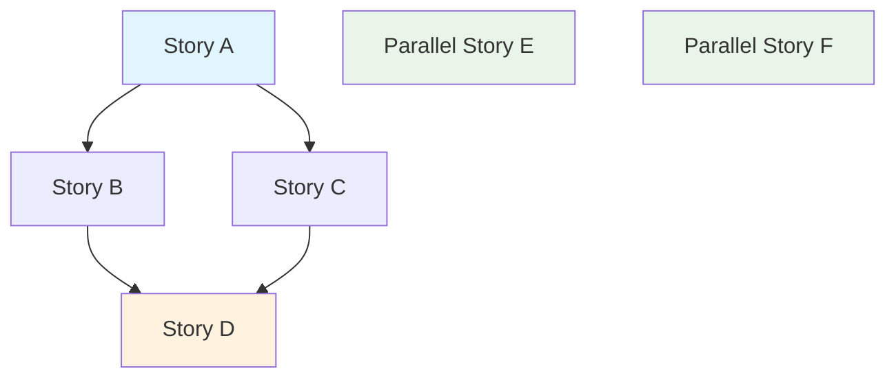

# Sprint Planning Template

## 📋 **Project Overview**

**Project Name**: [Project Name]  
**Sprint Duration**: [X weeks/days]  
**Sprint Number**: [Sprint #]  
**Team Size**: [X developers + Y QA + Z others]  
**Sprint Goal**: [High-level objective for this sprint]  

## 👥 **Team Composition & Capacity**

| Role | Count | Capacity (SP/Sprint) | Notes |
|------|-------|---------------------|-------|
| [Developer Type] | [X] | [Y] SP each | [Availability notes] |
| [QA/Tester] | [X] | [Y] SP | [Testing focus] |
| [Other Role] | [X] | [Y] SP | [Role specifics] |
| **Total Team Capacity** | | **[Z] Story Points** | |

### **Individual Capacity Notes:**
- **[Team Member 1]**: [Capacity notes, vacation, etc.]
- **[Team Member 2]**: [Capacity notes, availability, etc.]

## 📊 **Sprint Backlog**

### **Stories Selected for Sprint**

| Story ID | Story Title | Estimate (SP) | Assignee | Priority | Dependencies | Type |
|----------|-------------|---------------|----------|----------|--------------|------|
| [Epic.Story] | [Story Name] | [X] SP | [Person] | P[0-3] | [Other stories] | [Feature/Bug/Tech Debt] |
| [Epic.Story] | [Story Name] | [X] SP | [Person] | P[0-3] | [Other stories] | [Feature/Bug/Tech Debt] |
| [Epic.Story] | [Story Name] | [X] SP | [Person] | P[0-3] | [Other stories] | [Feature/Bug/Tech Debt] |

**Total Selected**: [X] Story Points  
**Team Capacity**: [Y] Story Points  
**Buffer**: [Y-X] Story Points ([%] buffer)  
**Technical Debt Allocation**: [Z] SP ([%] of sprint)

## ⚡ **Parallel Development Strategy**

### **Parallel Work Optimization:**
- **Story Splitting Strategy**: [How to enable parallel development]
- **Dependency Minimization**: [Techniques to reduce blocking dependencies]
- **Interface Definition**: [Clear contracts between parallel work streams]
- **Integration Points**: [When and how parallel work gets integrated]

### **Team Utilization Plan:**
- **Target Utilization**: [80-85%] sustainable capacity
- **Waiting Time Elimination**: [Strategies to keep developers active]
- **Cross-functional Support**: [How team members can help each other]

### 📊 **Sprint Timeline (Gantt Chart)**

```mermaid
gantt
    title [Sprint Name] Timeline - Parallel Optimized
    dateFormat  X
    axisFormat %d
    
    section [Team Member 1]
    [Story 1 Name]    :[task1], 0, 3
    [Story 2 Name]    :[task2], 3, 6
    Buffer/Support    :[buffer1], 6, 7
    
    section [Team Member 2]  
    [Story 3 Name]    :[task3], 0, 4
    [Story 4 Name]    :[task4], 4, 7
    
    section Integration
    Integration & QA  :[qa], 5, 7
```

### 👥 **Daily Assignment Plan**

| Day | [Team Member 1] | [Team Member 2] | [Team Member 3] | Integration Notes |
|-----|-----------------|-----------------|-----------------|-------------------|
| Day 1 | [Activity] | [Activity] | [Activity] | [Sprint kickoff] |
| Day 2 | [Activity] | [Activity] | [Activity] | [Sync points] |
| Day 3 | [Activity] | [Activity] | [Activity] | [Integration checkpoints] |
| ... | | | | |

### 🔄 **Dependencies & Critical Path**

```mermaid
graph TD
    A[Story A] --> B[Story B]
    A --> C[Story C]
    B --> D[Story D]
    C --> D
    E[Parallel Story E] 
    F[Parallel Story F]
    
    style A fill:#e1f5fe
    style D fill:#fff3e0
    style E fill:#e8f5e8
    style F fill:#e8f5e8
```

**Critical Path**: [Story A] → [Story B] → [Story D]  
**Parallel Streams**: [Story E], [Story F] (Independent)

## 🎯 **Definition of Done**

### **For Development Stories:**
- [ ] Acceptance criteria met and validated
- [ ] Code review completed and approved
- [ ] Unit tests written and passed (≥[X]% coverage)
- [ ] Integration tests passed
- [ ] Documentation updated (README, API docs)
- [ ] Build passes on all target platforms
- [ ] Performance criteria met (load time ≤[X]s)
- [ ] Security scan passed (no high/critical vulnerabilities)
- [ ] Accessibility standards met (WCAG [level])

### **For Bug Fix Stories:**
- [ ] Root cause identified and documented
- [ ] Fix implemented and tested
- [ ] Regression tests added
- [ ] Bug verification in staging environment

### **For Technical Debt Stories:**
- [ ] Code quality metrics improved
- [ ] Technical documentation updated
- [ ] Impact on team velocity measured

## 🔧 **Technical Debt Management**

### **Technical Debt Backlog:**
- **Current Technical Debt**: [X] story points
- **Sprint Allocation**: [Y] SP (Target: 15-20% of sprint capacity)
- **Debt Paydown Plan**: [Prioritized list of tech debt items]

### **Quality Gates:**
- **Code Coverage**: Minimum [X]% maintained
- **Code Quality**: [Sonar/quality tool] score ≥ [Y]
- **Performance**: Load time ≤ [Z] seconds
- **Security**: No high/critical vulnerabilities

---

## 📋 **Template Usage Instructions**

### **Pre-Sprint Setup:**
1. **Copy this template** for each new sprint
2. **Fill in project-specific details** in [brackets]
3. **Customize sections** based on team context and maturity
4. **Identify parallel development opportunities**

### **Template Customization Guidelines:**
- **Adapt sections** based on team size and experience level
- **Add technology-specific** DoD criteria as needed
- **Include compliance requirements** for regulated industries

**Template Version**: 2.0  
**Enhanced by**: Bob - Scrum Master  
**Last Updated**: [Current Date]  
**Focus**: Sustainable Parallel Development with Advanced Agile Practices 