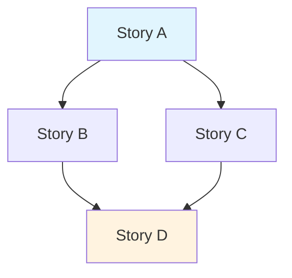

# Sprint Planning Template

## 📋 **Project Overview**

**Project Name**: [Project Name]  
**Sprint Duration**: [X weeks/days]  
**Sprint Number**: [Sprint #]  
**Team Size**: [X developers + Y QA + Z others]  
**Sprint Goal**: [High-level objective for this sprint]  

## 👥 **Team Composition & Capacity**

| Role | Count | Capacity (SP/Sprint) | Notes |
|------|-------|---------------------|-------|
| [Developer Type] | [X] | [Y] SP each | [Availability notes] |
| [QA/Tester] | [X] | [Y] SP | [Testing focus] |
| [Other Role] | [X] | [Y] SP | [Role specifics] |
| **Total Team Capacity** | | **[Z] Story Points** | |

### **Individual Capacity Notes:**
- **[Team Member 1]**: [Capacity notes, vacation, etc.]
- **[Team Member 2]**: [Capacity notes, availability, etc.]

## 📊 **Sprint Backlog**

### **Stories Selected for Sprint**

| Story ID | Story Title | Estimate (SP) | Assignee | Priority | Dependencies |
|----------|-------------|---------------|----------|----------|--------------|
| [Epic.Story] | [Story Name] | [X] SP | [Person] | P[0-3] | [Other stories] |
| [Epic.Story] | [Story Name] | [X] SP | [Person] | P[0-3] | [Other stories] |
| [Epic.Story] | [Story Name] | [X] SP | [Person] | P[0-3] | [Other stories] |

**Total Selected**: [X] Story Points  
**Team Capacity**: [Y] Story Points  
**Buffer**: [Y-X] Story Points ([%] buffer)

### **Sprint Goal Breakdown**
- **Primary Objective**: [Main goal]
- **Secondary Objectives**: [Supporting goals]
- **Success Criteria**: [How to measure success]

## ⚡ **Work Strategy & Timeline**

### 📊 **Sprint Timeline (Gantt Chart)**

```mermaid
gantt
    title [Sprint Name] Timeline
    dateFormat  X
    axisFormat %d
    
    section Week 1
    [Story 1 Name]    :[task1], 0, 3
    [Story 2 Name]    :[task2], 1, 4
    
    section Week 2  
    [Story 3 Name]    :[task3], 3, 6
    [Story 4 Name]    :[task4], 4, 7
```

### 👥 **Daily Assignment Plan**

| Day | [Team Member 1] | [Team Member 2] | [Team Member 3] | Notes |
|-----|-----------------|-----------------|-----------------|-------|
| Day 1 | [Activity] | [Activity] | [Activity] | [Sprint kickoff] |
| Day 2 | [Activity] | [Activity] | [Activity] | |
| Day 3 | [Activity] | [Activity] | [Activity] | |
| ... | | | | |

### 🔄 **Dependencies & Risks**

```mermaid
graph TD
    A[Story A] --> B[Story B]
    A --> C[Story C]
    B --> D[Story D]
    C --> D
    
    style A fill:#e1f5fe
    style D fill:#fff3e0
```

**Critical Path**: [Story A] → [Story B] → [Story D]

## 🎯 **Definition of Done**

### **For Development Stories:**
- [ ] [Acceptance criteria met]
- [ ] [Code review completed]
- [ ] [Unit tests written/passed]
- [ ] [Integration tests passed]
- [ ] [Documentation updated]
- [ ] [Build passes on target platforms]
- [ ] [Performance criteria met]

### **For [Specific Type] Stories:**
- [ ] [Type-specific criteria]
- [ ] [Additional requirements]

## 🚫 **Risks & Mitigation**

| Risk | Probability | Impact | Mitigation Strategy |
|------|-------------|---------|-------------------|
| [Risk description] | [High/Med/Low] | [High/Med/Low] | [How to handle] |
| [Risk description] | [High/Med/Low] | [High/Med/Low] | [How to handle] |

## 📅 **Sprint Events Schedule**

| Event | Date/Time | Duration | Attendees | Agenda |
|-------|-----------|----------|-----------|--------|
| Sprint Planning | [Date, Time] | [X hours] | [Team] | [Plan sprint backlog] |
| Daily Standups | Daily [Time] | [15 min] | [Team] | [3 questions format] |
| Sprint Review | [Date, Time] | [X hours] | [Team + Stakeholders] | [Demo completed work] |
| Sprint Retrospective | [Date, Time] | [X hours] | [Team] | [Process improvement] |

## 📝 **Daily Standup Template**

**Each team member answers:**
1. What did I complete yesterday?
2. What will I work on today?  
3. Are there any impediments blocking me?

**Focus Areas:**
- Story progress toward sprint goal
- Blockers and dependencies
- Team collaboration needs

## 📈 **Success Metrics**

### **Sprint Success Criteria:**
- [ ] [Sprint goal achieved]
- [ ] [X% of committed stories completed]
- [ ] [Quality criteria met]
- [ ] [No critical bugs introduced]

## 🎉 **Sprint Review Preparation**

### **Demo Preparation:**
- [ ] [Feature 1 demo ready]
- [ ] [Feature 2 demo ready]
- [ ] [Demo environment setup]
- [ ] [Stakeholder invites sent]

### **Retrospective Topics:**
- [ ] What went well?
- [ ] What could be improved?
- [ ] Action items for next sprint

---

## 📋 **Template Usage Instructions**

1. **Copy this template** for each new sprint
2. **Fill in project-specific details** in [brackets]
3. **Customize sections** based on team needs
4. **Update timeline** with actual dates
5. **Adjust capacity** based on team availability
6. **Review and approve** with team before sprint start

**Template Version**: 1.0  
**Created by**: [Scrum Master Name]  
**Last Updated**: [Date] 