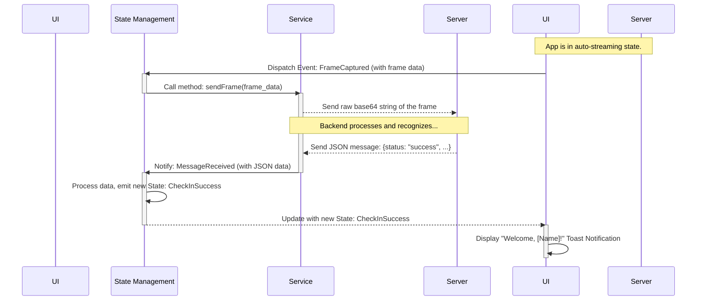

# FaceCheckIn Employee Architecture Document

### **1.0 Introduction**

This document outlines the technical architecture for the "FaceCheckIn Employee" Flutter application. It serves as the guiding blueprint for development, ensuring consistency, maintainability, and adherence to the chosen patterns and technologies. This document is intended to be used in conjunction with the Product Requirements Document (PRD) v1.1 and the UI/UX Specification.

### **2.0 Project Structure**

The project follows a standardized structure to ensure clarity, maintainability, and alignment with Clean Architecture principles.

#### **2.1 Guiding Principles**

- **Layer-First (Clean Architecture):** The primary organization under `lib/` directly reflects the Clean Architecture layers.
- **Feature Grouping within Layers:** Code related to specific features will be grouped together as subdirectories within each appropriate layer.
- **Clarity & Convention:** Use clear and consistent naming for directories and files.
- **Testability:** The structure of the `test/` directory **MUST** mirror the `lib/` directory structure to make tests easy to locate and ensure complete coverage.
- **Dependency Rule Enforcement:** The directory structure should visually reinforce the Clean Architecture dependency rule (dependencies flow inwards: Presentation → Domain, Data → Domain).

#### **2.2 Top-Level Directory Structure**

```
face-check-in-flutter/
├── android/
├── ios/
├── lib/                          # Main Dart application code (detailed below)
├── test/                         # Unit and widget tests (mirrors /lib)
├── .gitignore
├── analysis_options.yaml
├── pubspec.yaml
└── README.md
```

#### **2.3 `lib/` Directory Structure**

The `lib/` directory is the heart of the application, containing all Dart code.

```
lib/
├── app/                          # Root application widget and BLoC observer setup
├── core/                         # Cross-cutting concerns & framework setup
│   ├── services/                 # Cross-cutting services (e.g., WebSocketService)
│   └── ...                       # Other core modules like constants, utils, etc.
│
├── features/                     # Feature-based modules (UI and BLoC logic)
│   └── [feature_name]/           # e.g., check_in
│       ├── bloc/                 # BLoCs or Cubits for state management
│       ├── view/                 # Feature-specific full screens/pages
│       └── widgets/              # UI components specific to this feature
│
├── data/                         # Data Layer: implements repository interfaces, data sources
│   └── ...
│
└── domain/                       # Domain Layer: Pure business logic (entities, usecases, repository interfaces)
    └── ...
```

#### **2.4 `test/` Directory Structure**

The `test/` directory **MUST** mirror the `lib/` structure precisely. This ensures that for any file in `lib/`, its corresponding test file can be found at the exact same path under `test/`.

**Example:**
- A service at `lib/core/services/websocket_service.dart`
- Will have its test file at `test/core/services/websocket_service_test.dart`.

- A screen at `lib/features/check_in/view/check_in_screen.dart`
- Will have its widget test at `test/features/check_in/view/check_in_screen_test.dart`.

```
test/
├── core/
│   └── services/
│       └── websocket_service_test.dart
│
└── features/
    └── check_in/
        └── view/
            └── check_in_screen_test.dart
```
This structure makes navigation intuitive and enforces a clear testing strategy.

### **3.0 WebSocket Communication Protocol**

**3.1 Backend Configuration**

* **Development Environment**: `wss://facedetection-ws.owt.vn`
* **Production Environment**: `wss://your_production_ws_url`
* **Protocols**: `WSS`
* **Connection Timeout**: 30 seconds
* **Retry Policy**: 3 attempts with 3-second delays
* **Authentication**: None (currently)
* **Status**: ✅ **Confirmed** - Backend ready at `wss://facedetection-ws.owt.vn`

**3.2 Client (Flutter App) to Server Message**

* **Format**: The application will send the raw **base64 string of the image frame** directly over the WebSocket connection, with no JSON wrapping.

**3.3 Server to Client (Flutter App) Messages**

The server will respond with a JSON message. The client will determine the outcome based on the contents of the `data.faces` array.

* **Client-Side Processing Logic**:
    * If `data.faces` array is **empty `[]`**: Treat as a **failure**.
    * If `data.faces` array **contains one or more objects**: Treat as a **success**. Use the first element (`data.faces[0]`) to display information.

* **Failure Response Structure**:
    ```json
    {
      "type": "frameResult",
      "data": {
        "faces": [],
        "faceImagePath": "",
        "cameraId": "1",
        "timestamp": "2025-06-12T09:00:00.000Z",
        "processingTime": 1000,
        "isCheckinSent": false
      }
    }
    ```

* **Success Response Structure** (Real Sample Data):
    ```json
    {
      "type": "frameResult",
      "data": {
        "faces": [
          {
            "faceId": "person_001",
            "isRecognized": true,
            "confidence": 0.92,
            "gender": "male",
            "age": 28,
            "mask": false,
            "bbox": [150, 120, 250, 220]
          }
        ],
        "faceImagePath": "https://storage.example.com/faces/camera1-2024-03-20T10:30:00.jpg",
        "cameraId": "camera_001",
        "timestamp": "2024-03-20T10:30:00.000Z",
        "processingTime": 250,
        "isCheckinSent": true,
        "originalSize": {"width": 1920, "height": 1080},
        "processedSize": {"width": 640, "height": 480},
        "annotatedImage": "base64_encoded_image_string_here"
      }
    }
    ```

### **4.0 Error Handling & Risk Mitigation Strategy**

#### **4.1 WebSocket Connection Management**
* **Backend URL**: `wss://facedetection-ws.owt.vn` (Development Environment - Confirmed Ready)
* **Connection Failure**: The `WebSocketService` will automatically attempt to **reconnect 3 times**, with a 3-second delay between each attempt. If all retries fail, an error state will be triggered in the UI.
* **Connection Timeout**: If connection cannot be established within **30 seconds**, treat as timeout error.
* **Connection Loss During Streaming**: Automatically pause streaming, attempt reconnection, resume when connection restored.

#### **4.2 Backend Service Dependency Risks**
* **Backend Unavailability**: 
  - **Development**: Backend confirmed available at `wss://facedetection-ws.owt.vn`
  - **Testing**: Real backend responses available for testing
  - **Graceful Degradation**: Show "Backend unavailable" status to user
  - **Backup Plan**: Use mock WebSocket server if needed
* **API Response Timeout**: If no response received within **30 seconds** of streaming start, stop streaming and reset state
* **Invalid Backend Responses**: Log malformed messages, continue operation without crashing
* **Backend Version Mismatch**: Implement version checking in WebSocket handshake

#### **4.3 Development Environment Risks**
* **Network Configuration**: Document network requirements for backend access
* **Certificate Issues**: Handle SSL certificate validation for development environments  
* **Firewall/Proxy**: Provide configuration guidance for corporate networks
* **Backend Setup**: Include backend service health check endpoints

#### **4.4 Production Deployment Risks**
* **Backend Endpoint Configuration**: Environment-specific configuration management
* **Service Discovery**: Dynamic backend endpoint resolution if required
* **Load Balancing**: Handle multiple backend instances gracefully
* **Service Monitoring**: Implement backend service health monitoring

#### **4.5 Data Processing Risks**
* **Image Processing Failure**: Skip failed frames, continue streaming with next frame
* **Memory Pressure**: Implement frame dropping and quality reduction under memory pressure
* **Device Performance**: Adapt frame rate and quality based on device capabilities
* **Storage Limitations**: Ensure no persistent storage of sensitive image data

#### **4.6 Fallback Strategies**
* **Offline Mode**: Display clear offline status, queue operations if feasible
* **Reduced Functionality**: Graceful degradation with clear user communication
* **Manual Override**: Allow manual check-in trigger for critical situations (post-MVP)
* **Service Recovery**: Automatic service restoration when conditions improve

### **5.0 Definitive Tech Stack Selections**

| Category | Technology / Library | Recommended Version | Description / Purpose |
| :--- | :--- | :--- | :--- |
| **Language** | Dart | ^3.4.0 | The primary language for Flutter development. |
| **Framework** | Flutter | ^3.22.0 | The primary framework for building the user interface. |
| **State Management** | `flutter_bloc` | ^8.1.0 | The primary library for implementing the BLoC pattern. |
| **Code Generation** | `freezed` | ^2.5.0 | To generate robust and immutable data classes/states. |
| | `freezed_annotation`| ^2.4.0 | Required annotations for `freezed`. |
| | `build_runner` | ^2.4.0 | Tool to run code generation tasks in Dart. |
| | `json_serializable`| ^6.8.0 | To automatically generate `fromJson`/`toJson` code. |
| **Communication** | `web_socket_channel`| ^2.4.0 | The standard Dart library for WebSocket communication. |
| **Camera & Permissions**| `camera` | ^0.11.0 | The official Flutter package for camera access. |
| | `permission_handler`| ^11.3.0 | To flexibly manage and request device permissions. |
| **Testing** | `flutter_test` | from SDK | Built-in tools for Unit and Widget testing. |
| | `bloc_test` | ^9.1.0 | A dedicated library to facilitate testing BLoCs. |
| | `mocktail` | ^1.0.0 | A mocking library for creating test doubles. |
| **Linting** | `flutter_lints` | ^4.0.0 | A set of rules to analyze and ensure code quality. |

### **6.0 Coding Standards**

* **Linter Adherence**: Strictly follow the rules defined in the `flutter_lints` package.
* **Code Generation**: After changing any model or state file annotated with `@freezed`, the developer must run the command `flutter pub run build_runner build --delete-conflicting-outputs` to update the generated files.
* **Naming Conventions**: `PascalCase` for classes/enums, `camelCase` for variables/methods, `snake_case` for filenames.
* **BLoC Pattern**: The UI must only interact with a BLoC. States must be immutable (enforced by `freezed`).
* **Asynchronous Code**: Always use `async`/`await` and `Future` objects for asynchronous operations.

### **7.0 Overall Testing Strategy**

* **Unit Tests**:
    * **Scope**: Focus on testing all business logic independently. This includes all logic within BLoCs, calculation functions, and data processing utilities.
    * **Requirement**: All BLoCs and files containing critical logic must have corresponding unit tests.
* **Widget Tests**:
    * **Scope**: Focus on testing individual widgets to ensure they render correctly and react to state changes from their BLoC (e.g., verifying a Toast is displayed on a `Success` state).
* **Test Coverage Target**:
    * For this MVP, a minimum Unit Test coverage of **70%** is targeted for files containing business logic (especially BLoC files). The quality of test cases remains the top priority.
* **Integration & E2E Tests**: These are out of scope for the MVP.

### **8.0 Core Workflow / Sequence Diagram**

This diagram illustrates the flow for a successful check-in.



### **9.0 Infrastructure and Deployment Overview**

* **Deployment Strategy (MVP)**: A "Manual Build & Distribute" process will be used. Developers will build the `.apk` (Android) and `.ipa` (iOS) files locally.
* **Distribution Method (MVP)**: The application installers will be distributed for testing via **Firebase App Distribution** or direct file transfer.
* **CI/CD (Post-MVP)**: A CI/CD pipeline (e.g., using GitHub Actions) should be set up after the MVP to automate the build and distribution process.
* **Rollback Strategy**: If a new version is faulty, the rollback procedure is to uninstall it and reinstall the last known stable version from its installer file.