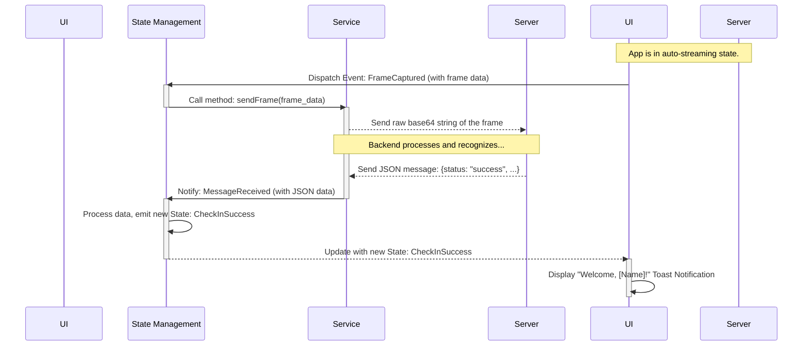

# FaceCheckIn Employee Architecture Document

### **1.0 Introduction**

This document outlines the technical architecture for the "FaceCheckIn Employee" Flutter application. It serves as the guiding blueprint for development, ensuring consistency, maintainability, and adherence to the chosen patterns and technologies. This document is intended to be used in conjunction with the Product Requirements Document (PRD) v1.1 and the UI/UX Specification.

### **2.0 Project Structure**

A "feature-first" directory structure will be adopted to group related code and enhance modularity. The primary source code will reside in the `lib/` directory.

```plaintext
lib/
├── app/
│   ├── app.dart              # Root application widget (MaterialApp/CupertinoApp)
│   └── simple_bloc_observer.dart # Class for observing BLoC state changes
│
├── core/
│   ├── services/
│   │   └── websocket_service.dart # Service to manage WebSocket connection
│   ├── models/
│   │   # Directory for data models generated by freezed
│   └── widgets/
│       └── toast_widget.dart    # Common widget for displaying Toast Notifications
│
├── features/
│   └── check_in/
│       ├── bloc/
│       │   ├── check_in_bloc.dart
│       │   ├── check_in_event.dart
│       │   └── check_in_state.dart
│       ├── view/
│       │   └── check_in_screen.dart # The main screen of the application
│       └── widgets/
│           ├── camera_preview_widget.dart # Widget for camera preview
│           └── debug_view_widget.dart   # Widget for the debug information view
│
└── main.dart                   # The application's entry point
```

### **3.0 WebSocket Communication Protocol**

**3.1 Client (Flutter App) to Server Message**

* **Format**: The application will send the raw **base64 string of the image frame** directly over the WebSocket connection, with no JSON wrapping.
    * *(Note: This needs final confirmation with the backend team as per our discussion.)*

**3.2 Server to Client (Flutter App) Messages**

The server will respond with a JSON message. The client will determine the outcome based on the contents of the `data.faces` array.

* **Client-Side Processing Logic**:
    * If `data.faces` array is **empty `[]`**: Treat as a **failure**.
    * If `data.faces` array **contains one or more objects**: Treat as a **success**. Use the first element (`data.faces[0]`) to display information.

* **Failure Response Structure**:
    ```json
    {
      "type": "frameResult",
      "data": {
        "faces": [],
        "faceImagePath": "",
        "cameraId": "1",
        "timestamp": "2025-06-12T09:00:00.000Z",
        "processingTime": 1000,
        "isCheckinSent": false
      }
    }
    ```

* **Success Response Structure**:
    ```json
    {
      "type": "frameResult",
      "data": {
        "faces": [
          {
            "faceId": "person_001",
            "isRecognized": true,
            "confidence": 0.92,
            "gender": "male",
            "age": 28,
            "mask": false,
            "bbox": [150, 120, 250, 220]
          }
        ],
        "faceImagePath": "https://storage.example.com/faces/camera1-2024-03-20T10:30:00.jpg",
        "cameraId": "camera_001",
        "timestamp": "2024-03-20T10:30:00.000Z",
        "processingTime": 250,
        "isCheckinSent": true
      }
    }
    ```

### **4.0 Error Handling Strategy**

* **WebSocket Connection Failure**: The `WebSocketService` will automatically attempt to **reconnect 3 times**, with a 3-second delay between each attempt. If all retries fail, an error state will be triggered in the UI.
* **Timeout**: If the application streams for **30 seconds** without receiving any response from the server, it will be treated as a timeout error. The application will stop streaming and reset its state.
* **Invalid Messages**: If an unexpected message format is received from the server, the application will log the error to the debug view and ignore the message, preventing a crash.

### **5.0 Definitive Tech Stack Selections**

| Category | Technology / Library | Recommended Version | Description / Purpose |
| :--- | :--- | :--- | :--- |
| **Language** | Dart | ^3.4.0 | The primary language for Flutter development. |
| **Framework** | Flutter | ^3.22.0 | The primary framework for building the user interface. |
| **State Management** | `flutter_bloc` | ^8.1.0 | The primary library for implementing the BLoC pattern. |
| **Code Generation** | `freezed` | ^2.5.0 | To generate robust and immutable data classes/states. |
| | `freezed_annotation`| ^2.4.0 | Required annotations for `freezed`. |
| | `build_runner` | ^2.4.0 | Tool to run code generation tasks in Dart. |
| | `json_serializable`| ^6.8.0 | To automatically generate `fromJson`/`toJson` code. |
| **Communication** | `web_socket_channel`| ^2.4.0 | The standard Dart library for WebSocket communication. |
| **Camera & Permissions**| `camera` | ^0.11.0 | The official Flutter package for camera access. |
| | `permission_handler`| ^11.3.0 | To flexibly manage and request device permissions. |
| **Testing** | `flutter_test` | from SDK | Built-in tools for Unit and Widget testing. |
| | `bloc_test` | ^9.1.0 | A dedicated library to facilitate testing BLoCs. |
| | `mocktail` | ^1.0.0 | A mocking library for creating test doubles. |
| **Linting** | `flutter_lints` | ^4.0.0 | A set of rules to analyze and ensure code quality. |

### **6.0 Coding Standards**

* **Linter Adherence**: Strictly follow the rules defined in the `flutter_lints` package.
* **Code Generation**: After changing any model or state file annotated with `@freezed`, the developer must run the command `flutter pub run build_runner build --delete-conflicting-outputs` to update the generated files.
* **Naming Conventions**: `PascalCase` for classes/enums, `camelCase` for variables/methods, `snake_case` for filenames.
* **BLoC Pattern**: The UI must only interact with a BLoC. States must be immutable (enforced by `freezed`).
* **Asynchronous Code**: Always use `async`/`await` and `Future` objects for asynchronous operations.

### **7.0 Overall Testing Strategy**

* **Unit Tests**:
    * **Scope**: Focus on testing all business logic independently. This includes all logic within BLoCs, calculation functions, and data processing utilities.
    * **Requirement**: All BLoCs and files containing critical logic must have corresponding unit tests.
* **Widget Tests**:
    * **Scope**: Focus on testing individual widgets to ensure they render correctly and react to state changes from their BLoC (e.g., verifying a Toast is displayed on a `Success` state).
* **Test Coverage Target**:
    * For this MVP, a minimum Unit Test coverage of **70%** is targeted for files containing business logic (especially BLoC files). The quality of test cases remains the top priority.
* **Integration & E2E Tests**: These are out of scope for the MVP.

### **8.0 Core Workflow / Sequence Diagram**

This diagram illustrates the flow for a successful check-in.



### **9.0 Infrastructure and Deployment Overview**

* **Deployment Strategy (MVP)**: A "Manual Build & Distribute" process will be used. Developers will build the `.apk` (Android) and `.ipa` (iOS) files locally.
* **Distribution Method (MVP)**: The application installers will be distributed for testing via **Firebase App Distribution** or direct file transfer.
* **CI/CD (Post-MVP)**: A CI/CD pipeline (e.g., using GitHub Actions) should be set up after the MVP to automate the build and distribution process.
* **Rollback Strategy**: If a new version is faulty, the rollback procedure is to uninstall it and reinstall the last known stable version from its installer file.