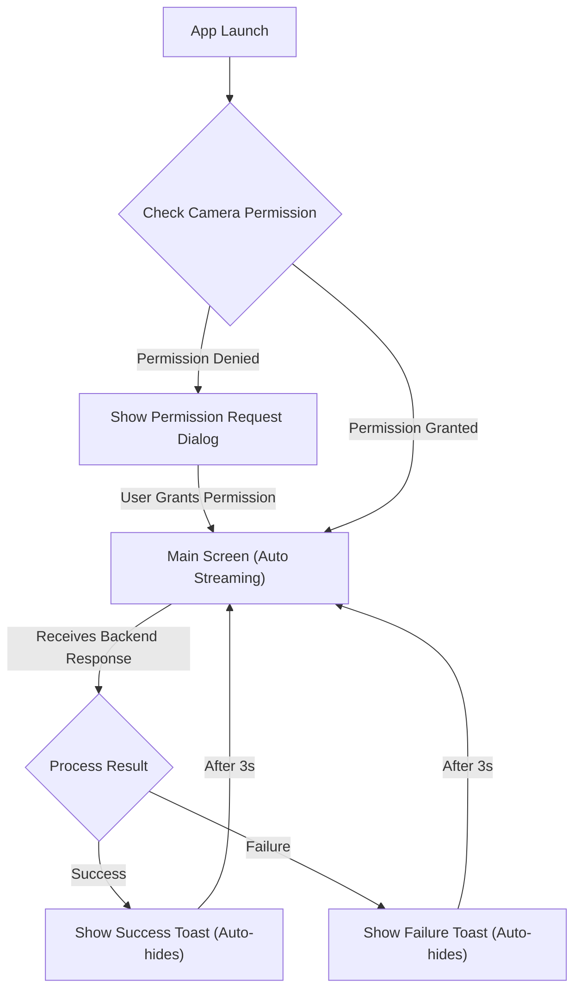

# FaceCheckIn Employee UI/UX Specification

### **Introduction**

This document defines the user experience goals, information architecture, user flows, and visual specifications for the "FaceCheckIn Employee" project's user interface.

* **Link to Primary Design Files (Figma, Sketch, etc.)**: `[NONE]` - The MVP will use default Flutter UI components (Material/Cupertino) to ensure simplicity and speed.

### **Overall UX Goals & Principles**

* **Target User Personas**: Company employees who desire a fast and frictionless check-in process.
* **Usability Goals**:
    * **Efficiency**: Optimize check-in speed.
    * **Ease of use**: Minimal user interaction, automated process.
    * **Clear Feedback**: Prevent confusion with immediate notifications.
* **Design Principles**:
    * **Minimalism**: Focus on the core recognition function.
    * **Clarity**: Information and feedback must be instantly understandable.
    * **Consistency**: Maintain consistency in the interface and feedback.

### **Information Architecture (IA)**

* **Screen & State Flow**:

* **Navigation Structure**: This is a single-screen application with no complex navigation. The workflow is automatically driven by the application's state (waiting, streaming, displaying result).
* **Post-MVP Enhancements**:
    * Audible feedback for successful/failed check-in.
    * Streaming Optimization: Replace the "Always Streaming" model with "On-device face detection" to automatically trigger streaming only when a person is in front of the camera, saving costs and bandwidth.

### **User Flows**

* **Flow 1: First-Time Launch**: Request and handle camera permissions. Guide the user to settings if denied.
* **Flow 2: Successful Check-in**: The app automatically streams, receives a success result from the backend, and displays a "Welcome, [Name]!" Toast.
* **Flow 3: Failed Check-in**: The app automatically streams, receives a failure result, and displays a "Recognition Failed. Please try again." Toast.

### **Branding & Style Guide Reference**

* **Color Palette**:
    * **Accent Color**: **Red**.
    * **Success Color**: Green (e.g., `Colors.green`).
    * **Failure Color**: Orange or Red (e.g., `Colors.orange`).
    * **Background & Text Colors**: Use default Flutter theme colors (light/dark) to ensure contrast and readability.
* **Typography**: Use default system fonts (**Roboto** for Android, **San Francisco** for iOS) to ensure consistency and performance.

### **Accessibility (AX) Requirements**

* **Compliance Standard**: **WCAG 2.1 AA**.
* **Specific Requirements**: High-contrast text; (Post-MVP) audible feedback.

### **Responsiveness**

* **Strategy**: Fluid layout that automatically scales to fit phone and tablet screen sizes.
