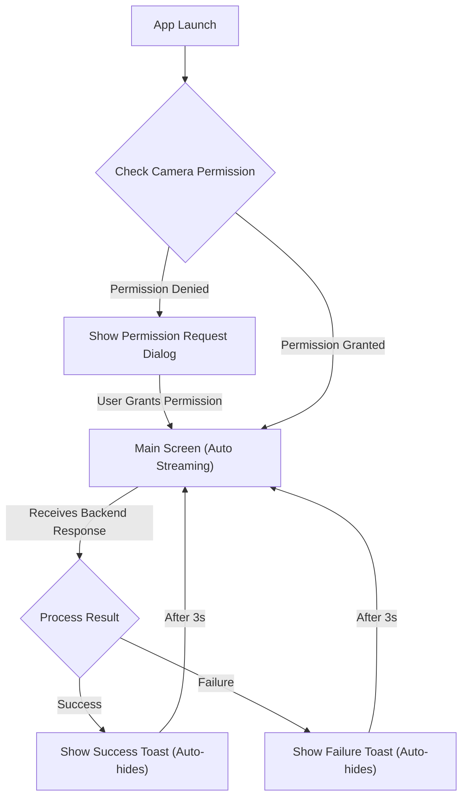

# Frontend User Flows

## Overall UX Goals & Principles

* **Target User Personas**: Company employees who desire a fast and frictionless check-in process
* **Usability Goals**:
    * **Efficiency**: Optimize check-in speed
    * **Ease of use**: Minimal user interaction, automated process
    * **Clear Feedback**: Prevent confusion with immediate notifications

## Information Architecture (IA)

### Screen & State Flow

### Navigation Structure
This is a single-screen application with no complex navigation. The workflow is automatically driven by the application's state (waiting, streaming, displaying result).

## User Flows

### Flow 1: First-Time Launch
Request and handle camera permissions. Guide the user to settings if denied.

### Flow 2: Successful Check-in
The app automatically streams, receives a success result from the backend, and displays a "Welcome, [Name]!" Toast.

### Flow 3: Failed Check-in
The app automatically streams, receives a failure result, and displays a "Recognition Failed. Please try again." Toast.

## Post-MVP Enhancements

* Audible feedback for successful/failed check-in
* Streaming Optimization: Replace the "Always Streaming" model with "On-device face detection" to automatically trigger streaming only when a person is in front of the camera, saving costs and bandwidth 