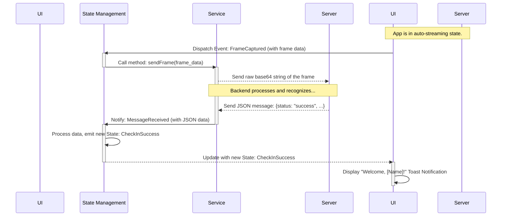

# Core Workflow / Sequence Diagrams

This diagram illustrates the flow for a successful check-in.

```mermaid
sequenceDiagram
    participant CheckInScreen as UI
    participant CheckInBloc as State Management
    participant WebSocketService as Service
    participant Backend as Server

    Note over UI, Server: App is in auto-streaming state.
    UI->>CheckInBloc: Dispatch Event: FrameCaptured (with frame data)
    activate CheckInBloc

    CheckInBloc->>WebSocketService: Call method: sendFrame(frame_data)
    deactivate CheckInBloc
    activate WebSocketService

    WebSocketService-->>Backend: Send raw base64 string of the frame
    
    Note over WebSocketService, Backend: Backend processes and recognizes...

    Backend-->>WebSocketService: Send JSON message: {status: "success", ...}
    
    WebSocketService->>CheckInBloc: Notify: MessageReceived (with JSON data)
    deactivate WebSocketService
    activate CheckInBloc

    CheckInBloc->>CheckInBloc: Process data, emit new State: CheckInSuccess
    
    CheckInBloc-->>UI: Update with new State: CheckInSuccess
    deactivate CheckInBloc
    activate UI

    UI->>UI: Display "Welcome, [Name]!" Toast Notification
    deactivate UI
``` 