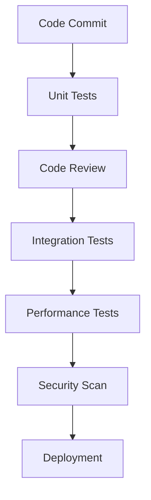

# Sprint Metrics & Quality Gates

## Performance Metrics

### 1. Development Metrics
- **Velocity**: Target 30 story points per sprint
- **Code Coverage**: Minimum 70% unit test coverage
- **Code Quality**:
  - Zero critical/high severity bugs
  - Maximum 5 medium severity bugs
  - SonarQube score > 85

### 2. Application Metrics
- **Camera Performance**:
  - Frame rate: 30 FPS minimum
  - Latency: < 100ms
  - Memory usage: < 200MB

- **WebSocket Performance**:
  - Connection stability: 99.9%
  - Message delivery: 99.9%
  - Reconnection time: < 2s

### 3. User Experience Metrics
- **App Launch Time**: < 2s
- **Camera Start Time**: < 1s
- **Recognition Time**: < 500ms
- **Toast Display Time**: 2-3s

## Quality Gates

### 1. Code Quality Gates

#### Pre-commit Checks
- Lint check
- Format check
- Basic unit tests
- No critical security issues

#### Pre-merge Checks
- All unit tests passing
- Code review approved
- SonarQube analysis passed
- No regression issues

#### Pre-deployment Checks
- Integration tests passing
- Performance benchmarks met
- Security scan passed
- Documentation updated

### 2. Feature Quality Gates

#### Camera Feature
- Camera preview working on all target devices
- Auto-start functionality reliable
- Permission handling complete
- Memory usage within limits

#### WebSocket Feature
- Connection stable
- Reconnection working
- Error handling complete
- Message processing verified

#### UI Features
- Toast notifications working
- Debug view functional
- UI responsive
- Accessibility standards met

## Contingency Plans

### 1. Technical Contingencies

#### Camera Issues
- **Fallback**: Use lower resolution
- **Mitigation**: Implement frame skipping
- **Rollback**: Disable auto-start
- **Escalation**: Contact device manufacturer

#### WebSocket Issues
- **Fallback**: Switch to REST API
- **Mitigation**: Implement message queue
- **Rollback**: Use polling
- **Escalation**: Contact backend team

#### Performance Issues
- **Fallback**: Reduce frame rate
- **Mitigation**: Optimize memory usage
- **Rollback**: Disable non-critical features
- **Escalation**: Performance team review

### 2. Project Contingencies

#### Resource Unavailability
- **Plan A**: Cross-train team members
- **Plan B**: Adjust sprint scope
- **Plan C**: Extend sprint duration
- **Escalation**: Project manager

#### Scope Changes
- **Plan A**: Review and reprioritize
- **Plan B**: Split into smaller stories
- **Plan C**: Move to next sprint
- **Escalation**: Product owner

#### Integration Issues
- **Plan A**: Use mock services
- **Plan B**: Implement workarounds
- **Plan C**: Delay integration
- **Escalation**: Technical lead

## Monitoring & Alerts

### 1. Performance Monitoring
- **Metrics**:
  - CPU usage
  - Memory usage
  - Frame rate
  - Network latency

- **Alerts**:
  - CPU > 80%
  - Memory > 200MB
  - Frame rate < 25 FPS
  - Latency > 100ms

### 2. Error Monitoring
- **Metrics**:
  - Error rate
  - Crash rate
  - Exception types
  - Stack traces

- **Alerts**:
  - Error rate > 1%
  - Crash rate > 0.1%
  - Critical exceptions
  - Memory leaks

### 3. User Experience Monitoring
- **Metrics**:
  - App launch time
  - Feature usage
  - User feedback
  - Session duration

- **Alerts**:
  - Launch time > 2s
  - Feature failure
  - Negative feedback
  - Short sessions

## Reporting

### 1. Daily Reports
- Build status
- Test results
- Performance metrics
- Error logs

### 2. Weekly Reports
- Sprint progress
- Quality metrics
- Risk status
- Resource utilization

### 3. Sprint Reports
- Velocity
- Quality gates
- User feedback
- Lessons learned

## Review & Improvement

### 1. Daily Review
- Performance metrics
- Error logs
- Team blockers
- Resource needs

### 2. Weekly Review
- Sprint progress
- Quality metrics
- Risk assessment
- Process improvement

### 3. Sprint Review
- Overall performance
- Quality gates
- Team feedback
- Process optimization 