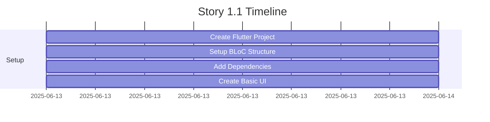
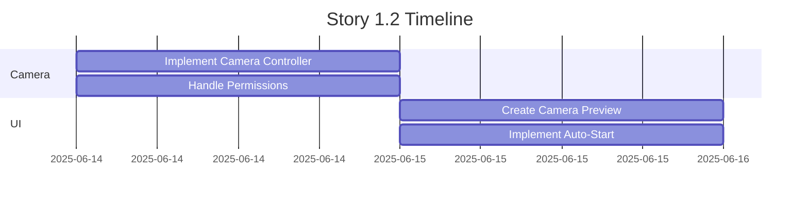
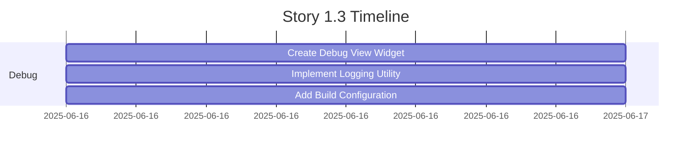
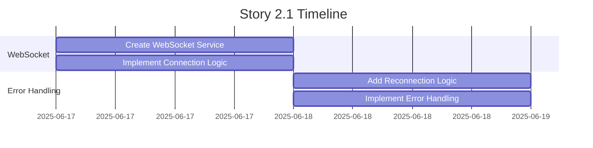
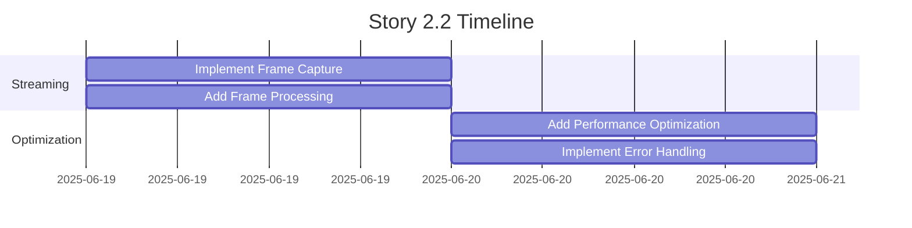
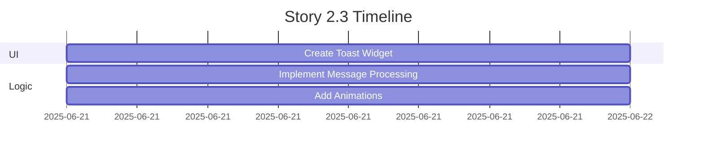
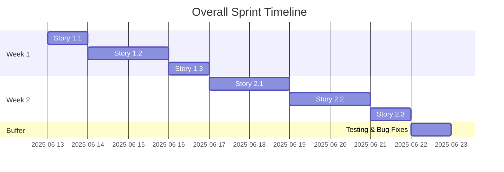
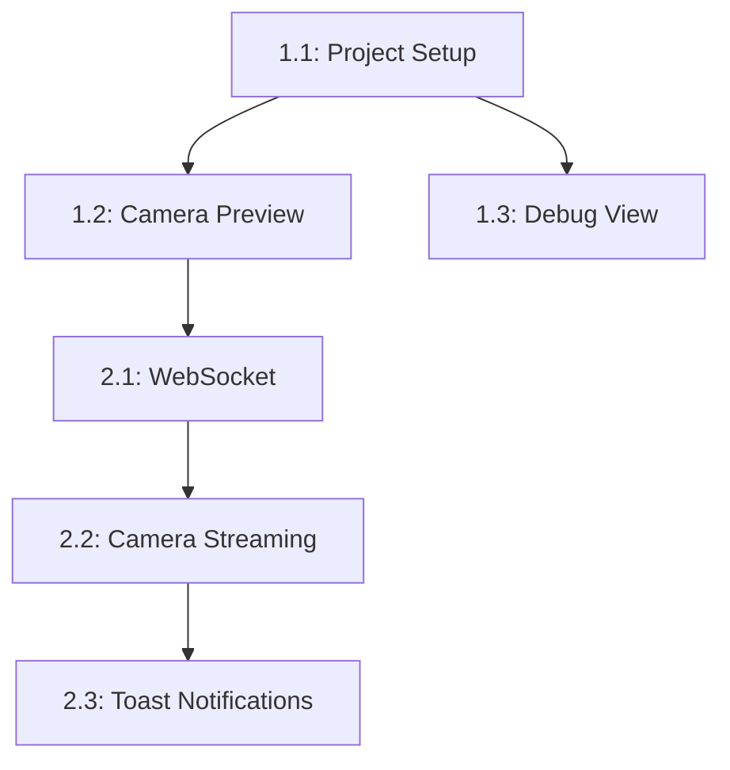
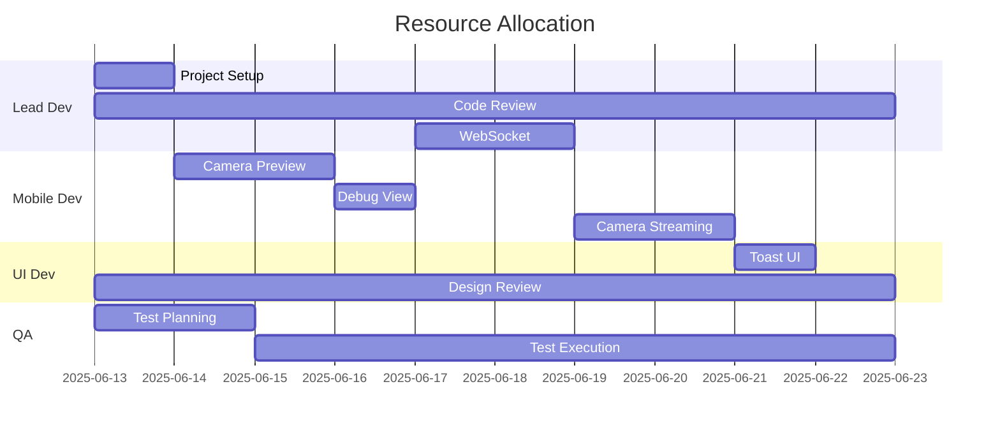
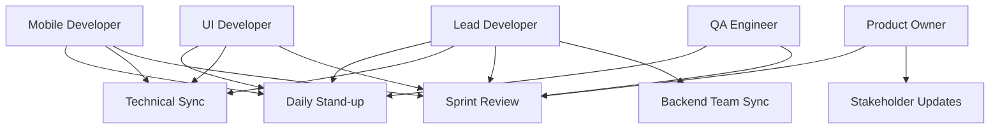

# FaceCheckIn Employee - Sprint Planning

## Overview
- **Project**: FaceCheckIn Employee
- **Sprint Duration**: 2 weeks
- **Sprint Goal**: Implement MVP of the FaceCheckIn application
- **Total Stories**: 6
- **Total Estimated Days**: 9 working days
- **Buffer**: 1 day for testing and bug fixes

## Key Milestones
1. **Project Setup Complete** (June 13, 2025)
   - Flutter project initialized
   - BLoC structure implemented
   - Basic UI framework ready

2. **Camera Integration Complete** (June 15, 2025)
   - Camera preview working
   - Auto-start functionality implemented
   - Permissions handling complete

3. **Debug Infrastructure Ready** (June 16, 2025)
   - Debug view implemented
   - Logging system in place
   - Build configurations set up

4. **Backend Integration Complete** (June 18, 2025)
   - WebSocket connection established
   - Error handling implemented
   - Reconnection logic working

5. **Streaming System Ready** (June 20, 2025)
   - Frame capture working
   - Processing pipeline implemented
   - Performance optimized

6. **MVP Complete** (June 22, 2025)
   - All features implemented
   - Testing completed
   - Ready for UAT

## Sprint 1: Foundation & Core Features (Week 1)

### Story 1.1: Project Initialization & BLoC Structure
**Priority**: Highest
**Estimate**: 1 day
**Dependencies**: None
**Assigned To**: Lead Developer

### Story 1.2: Live Camera Preview & Auto-Start
**Priority**: High
**Estimate**: 2 days
**Dependencies**: Story 1.1
**Assigned To**: Mobile Developer

### Story 1.3: Debug View
**Priority**: Medium
**Estimate**: 1 day
**Dependencies**: Story 1.1
**Assigned To**: Mobile Developer

## Sprint 2: Recognition & Feedback (Week 2)

### Story 2.1: WebSocket Connection
**Priority**: High
**Estimate**: 2 days
**Dependencies**: Story 1.2
**Assigned To**: Lead Developer

### Story 2.2: Camera Streaming
**Priority**: High
**Estimate**: 2 days
**Dependencies**: Story 2.1
**Assigned To**: Mobile Developer

### Story 2.3: Toast Notifications
**Priority**: High
**Estimate**: 1 day
**Dependencies**: Story 2.2
**Assigned To**: UI Developer

## Overall Sprint Timeline

## Task Dependencies

## Resource Assignment

### Team Members
1. **Lead Developer**
   - Story 1.1: Project Setup
   - Story 2.1: WebSocket
   - Code review for all stories
   - Technical guidance
   - Backend integration support

2. **Mobile Developer**
   - Story 1.2: Camera Preview
   - Story 1.3: Debug View
   - Story 2.2: Camera Streaming

3. **UI Developer**
   - Story 2.3: Toast Notifications
   - UI/UX review
   - Design implementation

4. **QA Engineer**
   - Test planning
   - Test execution
   - Bug reporting

### Resource Allocation
- **Week 1**: Focus on foundation (Lead Dev, Mobile Dev)
- **Week 2**: Focus on integration (Lead Dev, UI Dev)
- **Throughout**: QA involvement

## Sprint Goals and Success Criteria

### Goals
1. Complete the basic application structure
2. Implement facial recognition functionality
3. Ensure backend communication
4. Provide user feedback

### Success Criteria
- All stories completed according to their Definition of Done
- Code review completed
- Unit test coverage > 70%
- Application runs stably on test device
- No critical bugs

## Dependencies and Prerequisites

### Technical Dependencies
- WebSocket URL and backend configuration ready
- Test device (tablet) with camera available
- Test environment for backend

### Team Dependencies
- Backend team available for WebSocket protocol verification
- QA team for testing
- Design team for UI verification

## Risk Management

### Identified Risks
1. Backend API changes during development
2. Camera performance issues on test devices
3. WebSocket connection stability
4. Memory usage with continuous streaming

### Mitigation Strategies
1. Regular communication with backend team
2. Early testing on target devices
3. Implement robust error handling
4. Monitor and optimize memory usage

## Daily Stand-up Focus Areas

### Week 1
- Project setup progress
- Camera implementation challenges
- Debug view requirements

### Week 2
- WebSocket connection status
- Streaming performance
- Toast notification feedback

## Definition of Done

### For Each Story
- All acceptance criteria met
- Code reviewed and approved
- Unit tests written and passing
- Documentation updated
- No regression issues

### For Sprint
- All stories completed
- Integration tests passing
- Performance requirements met
- Ready for user acceptance testing

## Checkpoint Reviews

### Daily Checkpoints
- **Time**: 9:30 AM - 10:00 AM
- **Format**: Stand-up meeting
- **Participants**: All team members
- **Focus Areas**:
  1. Progress update
  2. Blockers identification
  3. Resource reallocation if needed

### Weekly Reviews
- **Time**: Friday 2:00 PM - 3:00 PM
- **Format**: Sprint review meeting
- **Participants**: All team members + Product Owner
- **Agenda**:
  1. Sprint progress review
  2. Demo completed features
  3. Risk assessment
  4. Next week planning

### Technical Reviews
- **Time**: Ad-hoc, scheduled 24h in advance
- **Format**: Technical deep-dive
- **Participants**: Technical team members
- **Focus Areas**:
  1. Architecture decisions
  2. Code review
  3. Performance optimization
  4. Security considerations

## Resource Adjustments

### Team Composition
1. **Core Team**
   - Lead Developer (Full-time)
   - Mobile Developer (Full-time)
   - UI Developer (Part-time, 40%)
   - QA Engineer (Part-time, 80%)

2. **Extended Team**
   - Product Owner (Part-time, 20%)
   - DevOps Engineer (On-demand)
   - Security Specialist (On-demand)

### Resource Allocation Matrix

## Detailed Risk Mitigation

### Technical Risks

1. **Backend API Changes**
   - **Impact**: High
   - **Probability**: Medium
   - **Mitigation**:
     - Weekly sync with backend team
     - API versioning strategy
     - Fallback mechanisms
     - Automated API tests

2. **Camera Performance**
   - **Impact**: High
   - **Probability**: Medium
   - **Mitigation**:
     - Early device testing
     - Performance benchmarking
     - Frame rate optimization
     - Memory management

3. **WebSocket Stability**
   - **Impact**: High
   - **Probability**: Low
   - **Mitigation**:
     - Robust reconnection logic
     - Connection monitoring
     - Error logging
     - Fallback to REST if needed

4. **Memory Usage**
   - **Impact**: Medium
   - **Probability**: High
   - **Mitigation**:
     - Memory profiling
     - Resource cleanup
     - Cache management
     - Regular performance testing

### Project Risks

1. **Resource Availability**
   - **Impact**: Medium
   - **Probability**: Low
   - **Mitigation**:
     - Cross-training team members
     - Documentation of critical paths
     - Backup resource identification

2. **Scope Creep**
   - **Impact**: High
   - **Probability**: Medium
   - **Mitigation**:
     - Clear acceptance criteria
     - Change request process
     - Regular scope review
     - Buffer in estimates

3. **Integration Issues**
   - **Impact**: High
   - **Probability**: Medium
   - **Mitigation**:
     - Early integration testing
     - API contract review
     - Integration documentation
     - Regular sync meetings

## Communication Plan

### Internal Communication

1. **Daily Stand-up**
   - **Time**: 9:30 AM - 10:00 AM
   - **Channel**: Video call
   - **Agenda**:
     - Yesterday's progress
     - Today's plan
     - Blockers
     - Resource needs

2. **Technical Sync**
   - **Time**: Tuesday & Thursday 2:00 PM - 3:00 PM
   - **Channel**: Video call
   - **Agenda**:
     - Technical challenges
     - Architecture decisions
     - Code review
     - Performance metrics

3. **Sprint Review**
   - **Time**: Friday 2:00 PM - 3:00 PM
   - **Channel**: Video call + Screen share
   - **Agenda**:
     - Sprint progress
     - Demo
     - Retrospective
     - Next sprint planning

### External Communication

1. **Stakeholder Updates**
   - **Frequency**: Weekly
   - **Format**: Email + Dashboard
   - **Content**:
     - Progress summary
     - Key achievements
     - Risk updates
     - Next week's plan

2. **Backend Team Sync**
   - **Frequency**: Bi-weekly
   - **Format**: Video call
   - **Agenda**:
     - API changes
     - Integration status
     - Performance metrics
     - Upcoming requirements

3. **Documentation Updates**
   - **Frequency**: As needed
   - **Format**: Wiki/Confluence
   - **Content**:
     - Technical documentation
     - API documentation
     - Setup guides
     - Troubleshooting guides

### Communication Matrix

