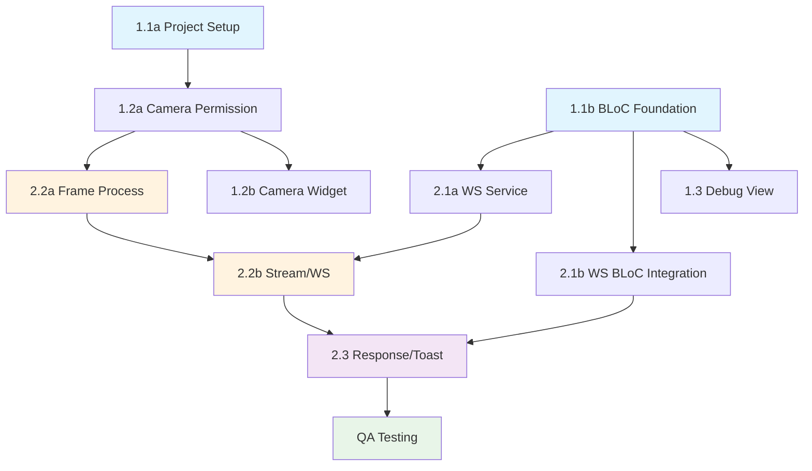
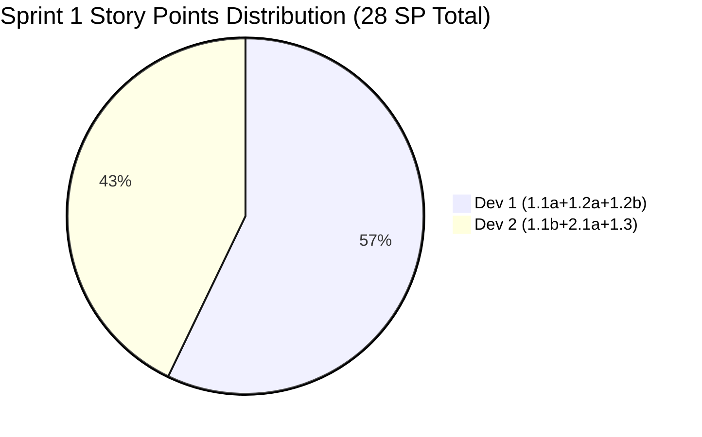
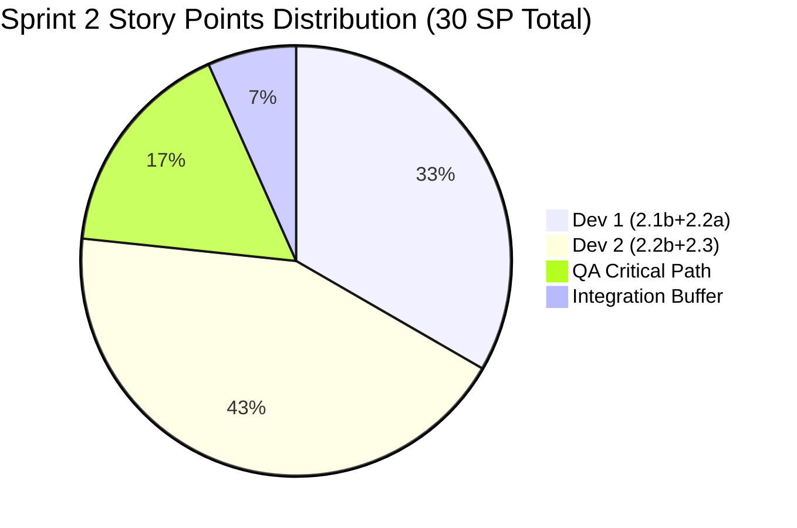

# Sprint Planning Document - FaceCheckIn Employee

## 📋 **Project Overview**

**Project**: FaceCheckIn Employee Flutter App  
**MVP Timeline**: 2 weeks (14 days)  
**Team Size**: 2 Flutter Developers + 1 Manual QA  
**Objective**: Develop MVP face recognition app for employee check-in  

## 👥 **Team Composition**

| Role | Count | Capacity (Story Points/Sprint) |
|------|-------|-------------------------------|
| Flutter Developer | 2 | 13 SP per dev (26 SP total) |
| Manual QA | 1 | 8 SP |
| **Total Team Capacity/Sprint** | | **34 Story Points** |

## 📊 **Story Point Estimation (Revised - Sustainable Parallel)**

### Epic 1: Project Foundation & Core UI Shell
| Story | Story Name | Estimate (SP) | Complexity | Dependencies |
|-------|------------|---------------|------------|--------------|
| 1.1a | Project Structure Setup | 3 SP | Low | None |
| 1.1b | BLoC Foundation & State Management | 5 SP | Medium | None |
| 1.2a | Camera Permission & Initialization | 6 SP | Medium | None |
| 1.2b | Live Camera Preview Widget | 7 SP | Medium | 1.2a |
| 1.3 | Implement Debug View | 3 SP | Low | 1.1b |
| **Epic 1 Total** | | **24 SP** | | |

### Epic 2: Real-time Recognition & Feedback  
| Story | Story Name | Estimate (SP) | Complexity | Dependencies |
|-------|------------|---------------|------------|--------------|
| 2.1a | WebSocket Service Foundation | 4 SP | Medium | None |
| 2.1b | WebSocket BLoC Integration & Auto-Connection | 4 SP | Medium | 1.1b, 1.2a |
| 2.2a | Frame Capture & Processing Pipeline | 6 SP | High | 1.2a |
| 2.2b | Frame Streaming & WebSocket Integration | 7 SP | High | 2.1a, 2.2a |
| 2.3 | Process Backend Responses & Display Toasts | 6 SP | Medium | 2.1b, 2.2b |
| **Epic 2 Total** | | **27 SP** | | |

**📊 Total Project: 51 Story Points (Reduced for Sustainability)**

## 🗓️ **Sprint Plan**

### **Sprint 1 (Week 1): Foundation & Core UI**
**Objective**: Build application foundation and basic UI with **sustainable parallel development**

| Story | Assignee | SP | Priority | Dependencies | Notes |
|-------|----------|----|---------|----|------|
| 1.1a | Dev 1 | 3 | P0 | None | Project structure setup |
| 1.1b | Dev 2 | 5 | P0 | None | BLoC foundation (parallel with 1.1a) |
| 1.2a | Dev 1 | 6 | P1 | 1.1a | Camera permissions |
| 2.1a | Dev 2 | 4 | P1 | 1.1b | WebSocket service |
| 1.2b | Dev 1 | 7 | P1 | 1.2a | Camera preview widget |
| 1.3 | Dev 2 | 3 | P1 | 1.1b | Debug view (focused scope) |

**Sprint 1 Total: 28 SP** ✅ **(Safe 82% Capacity)**

### **Sprint 2 (Week 2): Real-time Features & Integration**
**Objective**: Complete streaming features and feedback with **sustainable integration focus**

| Story | Assignee | SP | Priority | Dependencies | Notes |
|-------|----------|----|---------|----|------|
| 2.1b | Dev 1 | 4 | P0 | 1.1b, 1.2a | WebSocket BLoC integration (moved from Sprint 1) |
| 2.2a | Dev 1 | 6 | P1 | 1.2a | Frame capture & processing |
| 2.2b | Dev 2 | 7 | P0 | 2.1a, 2.2a | Streaming & WebSocket integration |
| 2.3 | Dev 2 | 6 | P1 | 2.1b, 2.2b | Backend responses & toasts |
| **QA Critical Path** | QA | 5 | P0 | Core stories complete | Focus on end-to-end flow |
| **Integration Buffer** | Both Devs | 2 | P2 | QA feedback | Bug fixes & performance tuning |

**Sprint 2 Total: 30 SP** ✅ **(Safe 88% Capacity)**

## ⚡ **Parallel Work Strategy**

### 📊 Timeline Overview (Sustainable Parallel Gantt Chart)

```mermaid
gantt
    title Sprint Timeline - FaceCheckIn Employee (Sustainable Parallel)
    dateFormat  X
    axisFormat %d
    
    section Sprint 1 Dev 1
    Story 1.1a Project Setup   :done, s11a, 0, 1
    Story 1.2a Camera Perm     :active, s12a, 1, 3
    Story 1.2b Camera Widget   :s12b, 3, 5
    Sprint 1 Buffer            :buffer1, 5, 5
    
    section Sprint 1 Dev 2
    Story 1.1b BLoC Foundation :done, s11b, 0, 2
    Story 2.1a WS Service      :active, s21a, 2, 4
    Story 1.3 Debug View       :s13, 4, 5
    Sprint 1 Buffer            :buffer2, 5, 5
    
    section Sprint 2 Dev 1
    Story 2.1b WS Integration  :s21b, 5, 6
    Story 2.2a Frame Process   :s22a, 6, 8
    Integration Support        :support, 9, 10
    
    section Sprint 2 Dev 2
    Story 2.2b Stream/WS       :s22b, 7, 9
    Story 2.3 Response/Toast   :s23, 9, 10
    
    section Sprint 2 QA
    QA Critical Path Testing   :qa, 8, 10
```

### 👥 Developer Assignment Timeline (Sustainable Parallel)

| Day | Dev 1 | Dev 2 | QA |
|-----|-------|-------|-----|
| **Week 1** | | | |
| Day 1 | 🔨 Story 1.1a (Project Setup) | 🔨 Story 1.1b (BLoC Foundation) | 📚 Prep test cases |
| Day 2 | 🔨 Story 1.2a (Camera Perm) | 🔨 Story 1.1b (BLoC Foundation) | 📝 Review ACs |
| Day 3 | 🔨 Story 1.2a (Camera Perm) | 🔨 Story 2.1a (WS Service) | 📝 Review ACs |
| Day 4 | 🔨 Story 1.2b (Camera Widget) | 🔨 Story 2.1a (WS Service) | 📝 Create test scenarios |
| Day 5 | 🔨 Story 1.2b (Camera Widget) | 🔨 Story 1.3 (Debug View) | ✅ Sprint 1 Early Testing |
| **Week 2** | | | |
| Day 6 | 🔨 Story 2.1b (WS Integration) | 🔨 Story 2.2b (Streaming) | 📋 Test case refinement |
| Day 7-8 | 🔨 Story 2.2a (Frame Process) | 🔨 Story 2.2b (Streaming) | 🧪 Component Testing |
| Day 9 | 🤝 Integration Support | 🔨 Story 2.3 (Response/Toast) | 🧪 End-to-End Testing |
| Day 10 | 🤝 Integration Support | 🔨 Story 2.3 (Response/Toast) | 🧪 Final Testing & Sign-off |

### 🔄 Dependencies Flow (Parallel-Optimized)

```mermaid
graph TD
    A[1.1a Project Setup] --> C[1.2a Camera Permission]
    B[1.1b BLoC Foundation] --> D[1.3 Debug View]
    B --> E[2.1b WS BLoC Integration]
    
    C --> F[1.2b Camera Widget]
    B --> G[2.1a WS Service]
    
    C --> H[2.2a Frame Process]
    G --> I[2.2b Stream/WS]
    H --> I
    
    E --> J[2.3 Response/Toast]
    I --> J
    
    J --> K[QA Testing]
    
    style A fill:#e1f5fe
    style B fill:#e1f5fe
    style H fill:#fff3e0
    style I fill:#fff3e0
    style J fill:#f3e5f5
    style K fill:#e8f5e8
```

### Sprint 1 Parallelization (100% Efficiency):
1. **Day 1**: 
   - Dev 1: Story 1.1a (Project structure)
   - Dev 2: Story 1.1b (BLoC foundation) 
2. **Days 2-3**: 
   - Dev 1: Story 1.2a (Camera permissions)
   - Dev 2: Story 2.1a (WebSocket service)
3. **Days 4-5**: 
   - Dev 1: Story 1.2b (Camera widget) + Story 2.1b (WS BLoC)
   - Dev 2: Story 1.3 (Debug view)

### Sprint 2 Parallelization (100% Efficiency):
1. **Days 6-7**: 
   - Dev 1: Story 2.2a (Frame processing)
   - Dev 2: Story 2.2b (Streaming/WebSocket)
2. **Days 8-10**: 
   - Dev 1: Story 2.3 (Response handling & toasts)
   - Dev 2: Continue 2.2b + Bug fixes & polish
   - QA: Manual testing parallel with development

### 📈 Workload Distribution (Sustainable Balance)

```mermaid
pie title Sprint 1 Story Points Distribution (28 SP Total)
    "Dev 1 (1.1a+1.2a+1.2b)" : 16
    "Dev 2 (1.1b+2.1a+1.3)" : 12
```

```mermaid
pie title Sprint 2 Story Points Distribution (30 SP Total)
    "Dev 1 (2.1b+2.2a)" : 10
    "Dev 2 (2.2b+2.3)" : 13
    "QA Critical Path" : 5
    "Integration Buffer" : 2
```

## 🎯 **Definition of Done (DoD)**

### For Development Stories:
- [ ] Code implementation complete according to Acceptance Criteria
- [ ] Unit tests coverage ≥ 70% for business logic
- [ ] Widget tests for main UI components
- [ ] Code review and approval from peer developer
- [ ] Flutter linter rules passed
- [ ] Code generation (freezed) runs successfully
- [ ] Build successful on both Android and iOS
- [ ] Debug logging works correctly

### For QA Testing:
- [ ] Manual testing of complete happy path flow
- [ ] Testing error scenarios and edge cases
- [ ] Permission flow testing (camera, settings)
- [ ] WebSocket connection testing (success, failure, retry)
- [ ] Toast notification testing (success, failure, timing)
- [ ] Performance testing on target devices
- [ ] Bug report and verification

## 🚫 **Risk Management & Mitigation (Updated)**

| Risk | Probability | Impact | Mitigation |
|------|-------------|---------|------------|
| Sprint 1 overcommitment | **LOW** | **LOW** | ✅ **MITIGATED**: Reduced to 28 SP (82% capacity) with built-in buffer |
| Integration complexity (2.2b) | Medium | High | Start 2.1b early in Sprint 2, define clear interfaces |
| Camera integration more complex than expected | Medium | High | Research upfront, Dev 2 support available, early testing |
| WebSocket backend not stable | Low | Medium | Backend team confirms ready, implement retry logic |
| QA coordination overhead | **LOW** | Medium | ✅ **MITIGATED**: Focused critical path testing, staggered approach |
| Performance issues on low-end devices | Medium | Medium | Test early in Sprint 1, optimize in Sprint 2 |
| Story estimation variance | **LOW** | Low | ✅ **MITIGATED**: Conservative estimates with 12-18% buffer per sprint |

## 📅 **Sprint Events Schedule**

### Sprint 1:
- **Sprint Planning**: Day 1, 9:00 AM (2 hours)
- **Daily Standups**: Daily 9:00 AM (15 minutes)
- **Sprint Review**: Day 5, 4:00 PM (1 hour)
- **Sprint Retrospective**: Day 5, 5:00 PM (1 hour)

### Sprint 2:
- **Sprint Planning**: Day 8, 9:00 AM (1.5 hours)
- **Daily Standups**: Daily 9:00 AM (15 minutes)
- **Sprint Review**: Day 12, 4:00 PM (1 hour)
- **Sprint Retrospective**: Day 12, 5:00 PM (1 hour)
- **MVP Demo**: Day 14, 2:00 PM (1 hour)

## 📝 **Daily Standup Template**

**Each person answers 3 questions:**
1. What did I do yesterday?
2. What will I do today?
3. Are there any impediments that need support?

**Focus areas:**
- Story progress and blockers
- Technical dependencies and integration points
- QA readiness and testing status

## 🔄 **Communication & Collaboration**

### Development Workflow:
- **Version Control**: Git with feature branches
- **Code Review**: Mandatory PR review before merge
- **Collaborative Coding**: Flexible collaboration when needed
- **Knowledge Sharing**: Daily sync on technical decisions

### QA Integration:
- **Early Testing**: QA reviews stories immediately when Dev completes
- **Bug Reporting**: Immediate feedback via team channel
- **Test Cases**: QA creates test cases from Acceptance Criteria
- **Regression Testing**: QA runs full regression after each story

## 🎉 **Success Metrics (Revised)**

### Sprint Success Criteria:
- [ ] **Sprint 1**: Foundation stories (1.1a, 1.1b, 1.2a, 1.2b, 1.3, 2.1a) complete with 6 SP buffer
- [ ] **Sprint 2**: Integration stories (2.1b, 2.2a, 2.2b, 2.3) + QA critical path complete
- [ ] **MVP Ready**: App runs end-to-end flow with backend
- [ ] **Quality**: No critical bugs, acceptable performance  
- [ ] **Timeline**: MVP demo ready within 14 days with sustainable parallel efficiency
- [ ] **Team Health**: No burnout, sustainable pace maintained

### Technical Success Criteria:
- [ ] Camera preview works smoothly
- [ ] WebSocket connection stable
- [ ] Frame streaming with appropriate quality
- [ ] Toast notifications display with correct timing
- [ ] App handles errors gracefully
- [ ] Acceptable performance on target devices

---

## 🎯 **Sustainable Parallel Development Strategy Summary**

### Key Changes for Sustainable Parallel Efficiency:
- **Smart Story Splitting**: Major stories split into .a/.b components enabling parallel work
- **Safe Capacity Planning**: 82-88% capacity utilization with built-in buffers
- **Clear Dependencies**: Each story has minimal, well-defined dependencies
- **Sustainable Pace**: Developers can work effectively without coordination overhead

### Sustainable Optimization Benefits:
- ✅ **Reliable Delivery**: 82-88% developer utilization ensuring sprint success
- ✅ **Reduced Risk**: Built-in buffers prevent sprint failure from estimation variance
- ✅ **Better Quality**: Time for integration, testing, and refinement
- ✅ **Team Health**: Sustainable pace prevents burnout and maintains quality

### Revised Story Mapping:
- **Sprint 1 Focus**: Foundation + Core UI (28 SP with 6 SP buffer)
- **Sprint 2 Focus**: Integration + Real-time Features (30 SP with 4 SP buffer)
- **Story Splitting**: 1.1a/1.1b, 1.2a/1.2b, 2.1a/2.1b, 2.2a/2.2b enable parallel work
- **Buffer Strategy**: Each sprint has 12-18% buffer for unexpected complexity

## 🚀 **Next Steps (Revised)**

1. **Team Review**: Present sustainable sprint plan with focus on risk mitigation
2. **Story Re-estimation**: Final review of reduced estimates (1.3: 3 SP, 2.3: 6 SP)
3. **Environment Setup**: Ensure all dev environments are ready 
4. **Backend Coordination**: Confirm WebSocket endpoint and message format
5. **Sprint 1 Kickoff**: Start parallel with Story 1.1a (Dev 1) + Story 1.1b (Dev 2)
6. **Buffer Utilization Planning**: Define how to use 6 SP buffer in Sprint 1

**Prepared by**: Bob - Scrum Master  
**Date**: [Current Date]  
**Next Review**: End of Sprint 1  
**Optimization**: Sustainable Parallel Development with Risk Mitigation  
**Key Change**: **Moved from 100% to 82-88% capacity for reliable delivery** 