# MVP Plan: FaceCheckIn Employee (2 Weeks)

## 📋 **Project Overview**

**Project Name**: FaceCheckIn Employee
**MVP Duration**: 2 Weeks (Gộp 2 sprint, mỗi sprint 1 tuần)
**Team Size**: 2 Flutter Developers, 1 QA
**MVP Goal**: Deliver a functional MVP that establishes the project foundation, implements the core UI with a live camera feed, and enables the end-to-end flow of streaming video and receiving recognition feedback from the backend.

## 👥 **Team Composition & Capacity**

| Role | Count | Capacity (SP/Sprint) | Notes |
|------|-------|---------------------|-------|
| Flutter Developer | 2 | TBD | Dev A, Dev B |
| QA Engineer | 1 | TBD | QA 1 |
| **Total Team Capacity** | | **TBD Story Points** | *Capacity will be determined during the MVP Kick-off/Planning meeting after team estimates stories.* |

### **Individual Capacity Notes:**
- **Dev A**: Full availability for 2 weeks.
- **Dev B**: Full availability for 2 weeks.
- **QA 1**: Full availability for 2 weeks.

## 📊 **MVP Backlog**

### **Stories Selected for MVP**

| Story ID | Story Title | Estimate (SP) | Assignee | Priority | Dependencies |
|----------|-------------|---------------|----------|----------|--------------|
| 1.1 | Project Initialization & BLoC Structure | 3 | Dev A | P0 | - |
| 1.2 | Implement Live Camera Preview & Auto-Start | 5 | Dev A | P1 | 1.1 |
| 1.3 | Implement Debug View | 2 | Dev B | P2 | 1.1 |
| 2.1 | Establish WebSocket Connection Automatically | 3 | Dev B | P1 | 1.1 |
| 2.2 | Stream Camera Frames via WebSocket | 8 | Dev A | P0 | 1.2, 2.1 |
| 2.3 | Process Backend Responses & Display Toasts | 3 | Dev B | P0 | 2.1 |

**Total Selected**: 24 Story Points

## ⚡ **Work Strategy & Timeline**

### 📊 **MVP Timeline (Gantt Chart)**

```mermaid
gantt
    title MVP Timeline (10-Day)
    dateFormat  X
    axisFormat Day %d
    
    section Dev 1
    Story 1.1a Project Setup        :t1a, 0, 2d
    Story 1.2a Camera Perm          :t12a, after t1a, 1d
    Story 1.2b Camera Widget        :t12b, after t12a, 2d
    Story 2.1b WS Integration       :t21b, after t12b, 2d
    Story 2.2a Frame Process        :t22a, after t21b, 2d

    section Dev 2
    Story 1.1b BLoC Foundation      :t1b, 0, 3d
    Story 2.1a WS Service           :t21a, after t1b, 2d
    Story 1.3 Debug View            :t13, after t21a, 1d
    Story 2.2b Stream/WS            :t22b, after t13, 2d
    Story 2.3 Response/Toast        :t23, after t22b, 2d

    section QA
    QA Testing                      :tqa, 1, 9d
```

### 👥 **Daily Assignment Plan**

| Day | Dev A | Dev B | QA 1 | Notes |
|-----|-----------------|-----------------|-----------------|-------|
| Day 1 | **Story 1.1**: Project Init | **Story 1.1**: Pair/Review | Test Plan Setup | MVP Kick-off |
| Day 2 | **Story 1.1**: Finish Init | **Story 1.3/2.1**: Prep | Test Cases for 1.1 | |
| Day 3 | **Story 1.2**: Camera Perms | **Story 1.3**: Debug UI | **Testing 1.1** | Foundation complete |
| Day 4 | **Story 1.2**: Camera Preview | **Story 2.1**: WebSocket Svc | **Testing 1.3** | Parallel work begins |
| Day 5 | **Story 1.2**: Finish Camera | **Story 2.1**: Finish WS | Regression W1 | Week 1 Review |
| Day 6 | **Story 2.2**: Frame Stream | **Story 2.3**: Response Models| Test Cases W2 | Week 2 Kick-off |
| Day 7 | **Story 2.2**: Isolate Proc | **Story 2.3**: Toast Service | **Testing 1.2, 2.1** | |
| Day 8 | **Story 2.2**: Finish Stream | **Story 2.3**: Finish Toast | **Testing 2.2** | Integration starts |
| Day 9 | Integration & Bug Fixes | Integration & Bug Fixes | **Testing 2.3** | Full E2E testing |
| Day 10| Final Polish & Demo Prep| Final Polish & Demo Prep| Final Regression | MVP Demo |

## 🎯 **Definition of Done**

### **For All Stories:**
- [ ] All Acceptance Criteria from the story file are met.
- [ ] Code has been reviewed and approved by at least one other developer.
- [ ] Unit tests are written for all new business logic (BLoCs, services) and achieve > 80% coverage.
- [ ] The feature is successfully tested and verified by QA.
- [ ] All code is formatted and passes linter checks.
- [ ] Documentation for new components/services is created or updated.

### **For Final MVP:**
- [ ] All stories are marked as "Done".
- [ ] End-to-end functionality is verified by QA on a physical test device.
- [ ] The app gracefully handles connection drops and backend errors.
- [ ] No critical bugs are present in the final build.

## 🚫 **Risks & Mitigation**

| Risk | Probability | Impact | Mitigation Strategy |
|------|-------------|---------|-------------------|
| Backend Unavailability | Medium | High | Dev B will implement the WebSocket service with a mock interface. |
| Backend API Mismatch | Medium | High | Sync with the backend team before Week 2 to confirm data formats. |
| Performance Bottlenecks | Medium | Medium | Profile the app during development, especially during frame conversion. |
| Camera Permission Issues| Low | Medium | Research and test on physical devices early in Week 1. |

## 📅 **MVP Events Schedule**

| Event | Date/Time | Duration | Attendees |
|-------|-----------|----------|-----------|
| MVP Kick-off & Planning| Day 1, 9:00 AM | 2 hours | Team, SM |
| Daily Standups | Daily 9:00 AM | 15 min | Team, SM |
| MVP Review / Demo | Day 10, 3:00 PM | 1 hour | Team + Stakeholders |
| MVP Retrospective | Day 10, 4:00 PM | 1 hour | Team, SM |

## 📈 **Success Metrics**

### **MVP Success Criteria:**
- [ ] Sprint goal is achieved: A user can receive "Welcome" or "Failed" toasts based on the live backend response.
- [ ] All 6 committed stories are completed and meet the Definition of Done.
- [ ] The application is stable and does not crash during the demo.
- [ ] Average check-in time (from face in frame to toast) is under the 3-second target.

## 🎉 **MVP Review Preparation**

### **Demo Preparation:**
- [ ] [Dev A] Prepare demo flow for camera & frame streaming part.
- [ ] [Dev B] Prepare demo flow for WebSocket connection and response handling.
- [ ] [QA 1] Verify the demo environment and test script.
- [ ] [SM] Ensure Stakeholder invites are sent and confirmed.
- [ ] The final build is deployed to a physical test device. 