# MVP Sprint Planning - Face Check-in Flutter Application

## 🚨 **Pre-Planning Validation Checklist** *(COMPLETED)*

**✅ USER CONTEXT VALIDATION:**
- [x] **Team Composition Confirmed**: 2 Senior Flutter Devs + 1 QA (100% availability)
- [x] **Story Priorities Defined**: Epic 1 + Epic 2 for MVP completion
- [x] **Sprint Goal Established**: Complete MVP with both foundation and recognition features  
- [x] **Constraints Identified**: 2-week sprint duration, Senior Dev #1 leads integration
- [x] **Capacity Reality Check**: Experienced team, no historical velocity data (first sprint)
- [x] **Quality Requirements**: Definition of Done established and validated

## 🔧 **Template Configuration**

**Template Adaptation Settings:**
- [x] **Team Size**: Small Team (2-3 people)
- [x] **Sprint Duration**: 2 weeks
- [x] **Project Type**: MVP/Greenfield
- [x] **Technology Stack**: Mobile (Flutter)
- [x] **Industry Domain**: Enterprise Software (Face Recognition)
- [x] **Documentation Strategy**: Comprehensive (BMad-style)
- [x] **Team Experience**: Advanced (Senior level)
- [x] **Work Model**: [Configured based on team setup]

## 📋 **Project Overview**

**Project Name**: Face Check-in Flutter Application  
**Sprint Duration**: 2 weeks (10 working days)  
**Sprint Number**: Sprint 1 (MVP)  
**Team Size**: 3 team members  
**Sprint Goal**: Deliver complete MVP with camera integration, UI foundation, and real-time face recognition via WebSocket streaming  
**Sprint Start Date**: [To be set by team]  
**Sprint End Date**: [Sprint start + 14 days]  
**Technical Scrum Master**: Bob (Story Creator & Sprint Planner)  
**Integration Lead**: Senior Flutter Dev #1  
**Project Context**: Real-time facial recognition employee check-in system with <3s recognition time and >95% accuracy targets

## 🔗 **Project Documentation & Tool References**

### **📚 Documentation Strategy: Comprehensive Documentation (BMad-style)**

### **Core Project Documents:**
- **Requirements/PRD**: `docs/prd.md` - Status: ✅ Current
- **Architecture Documentation**: `docs/architecture.md` - Status: ✅ Updated
- **Technology Stack & Setup**: `docs/tech-stack.md` - Status: ✅ Current
- **Definition of Done**: `docs/definition-of-done.md` - Status: ✅ Validated

### **Epic & Story Management: File-Based Management**
- **Active Epics**: 
  - `docs/epic-1.md` - Project Foundation & Core UI Shell (Status: Ready for Sprint)
  - `docs/epic-2.md` - Real-time Recognition & Feedback (Status: Ready for Sprint)
- **Story Backlog**: 
  - `docs/stories/` directory - Total: 6 stories (Epic 1: 3 stories, Epic 2: 3 stories)

### **Technical Documentation:**
- **API Documentation**: `docs/api-reference.md` - Status: ✅ Current
- **Testing Strategy**: `docs/testing-strategy.md` - Status: ✅ Current
- **Deployment Guide**: `docs/deployment-guide.md` - Status: ✅ Current
- **Project Structure**: `docs/project-structure.md` - Status: ✅ Current

### **Quality & Process Documents:**
- **Definition of Done**: `docs/definition-of-done.md` - Status: ✅ Validated
- **Operational Guidelines**: `docs/operational-guidelines.md` - Status: ✅ Current
- **Front-end Specifications**: `docs/front-end-spec.md` - Status: ✅ Current

## 🎯 **Sprint Success Criteria**

### **Primary Success Metrics:**
- [x] Sprint Goal Achievement: Complete Epic 1 (100%) + Epic 2 (100%) = Full MVP
- [x] Velocity Target: 42-48 Story Points (Estimated for experienced 3-person team)
- [x] Team Utilization: 80-85% sustainable capacity
- [x] Parallel Development Efficiency: >75% concurrent work time
- [x] Zero blocked stories at sprint end
- [x] Technical Debt: Maintain clean architecture per DoD standards

### **Quality Gates:**
- [x] All stories meet Definition of Done v1.0
- [x] Code coverage maintained at ≥80% for business logic
- [x] Performance benchmarks met: 
  - App launch time ≤2 seconds
  - Camera initialization ≤1 second  
  - Recognition response ≤3 seconds total
- [x] Security scan passes per DoD security standards
- [x] All features tested on Android 8+ and iOS 13+

### **Business Value Metrics:**
- [x] Camera integration completion rate: 100%
- [x] WebSocket streaming functionality: 100%
- [x] Real-time recognition pipeline: 100%
- [x] User feedback system: 100%

## 👥 **Team Composition & Capacity Analysis**

### **Team Capacity - MVP Focus with AI/Vibe Coding:**

| Role | Team Member | AI-Enhanced Capacity | Skills | Availability |
|------|-------------|---------------------|--------|--------------|
| **Senior Flutter Dev #1** | 54-60 SP | Flutter, BLoC, Architecture, WebSocket | 100% |
| **Senior Flutter Dev #2** | 48-54 SP | Flutter, BLoC, UI/UX, Testing | 100% |
| **QA Engineer** | 24-30 SP | Testing, Quality Validation, Automation | 100% |
| **Total** | **126-144 SP** | **Flutter Excellence & Full-stack MVP** | **100%** |

### **Capacity Planning Details:**

#### **Individual Capacity Analysis (AI/Vibe Coding Enhanced):**
- **Senior Dev #1 (Lead)**: 54-60 SP
  - **Base Development**: 48-52 SP (AI-accelerated development)
  - **Integration Overhead**: 6 SP (Epic 1 ↔ Epic 2 coordination)
  - **Code Review**: AI-assisted review process
  
- **Senior Dev #2**: 48-54 SP  
  - **Pure Development**: 48-54 SP (AI-accelerated development)
  - **No integration overhead** (focus on parallel stories)
  - **Code Review**: AI-assisted review process
  
- **QA Engineer**: 24-30 SP
  - **Testing Stories**: 20-24 SP (AI-powered test automation)
  - **DoD Validation**: 4-6 SP
  - **Test Automation**: AI-enhanced test generation

#### **Team Total Capacity:** 126-144 Story Points
- **Conservative Target**: 126 SP (87.5% utilization)
- **Stretch Target**: 144 SP (100% utilization)
- **Recommended Commitment**: 135 SP (94% utilization - sustainable for 2 weeks)

## 📊 **Story Analysis & Estimation**

### **Epic 1: Project Foundation & Core UI Shell**

#### **Story 1.1: Project Initialization & BLoC Structure**
- **Estimated SP**: 8 points
- **Complexity**: Medium-High (Architecture setup)
- **Risk Level**: Low (Well-defined technical task)
- **Dependencies**: None (Starting point)
- **Assigned To**: Senior Dev #1 (Integration Lead)
- **Parallel Opportunity**: Low (Foundation dependency for other stories)

**Acceptance Criteria Breakdown:**
1. Flutter project creation (1 SP)
2. BLoC folder structure (2 SP)
3. Dependencies setup (flutter_bloc, web_socket_channel) (2 SP)
4. Main screen layout (camera + debug areas) (2 SP)
5. App runs with placeholder (1 SP)

#### **Story 1.2: Implement Live Camera Preview & Auto-Start**
- **Estimated SP**: 13 points
- **Complexity**: High (Camera permissions + integration)
- **Risk Level**: Medium (Device-specific issues, permissions)
- **Dependencies**: Story 1.1 (BLoC structure)
- **Assigned To**: Senior Dev #1 (Integration Lead)
- **Parallel Opportunity**: Medium (Can start UI while 1.1 finalizes)

**Acceptance Criteria Breakdown:**
1. Camera permissions handling (4 SP)
2. Live camera preview display (5 SP)
3. Streaming state transition (2 SP)
4. Permission denied handling (2 SP)

#### **Story 1.3: Implement Debug View**
- **Estimated SP**: 5 points
- **Complexity**: Low-Medium (UI component + logging utility)
- **Risk Level**: Low (Standard UI development)
- **Dependencies**: Story 1.1 (Main screen structure)
- **Assigned To**: Senior Dev #2 (Parallel Development)
- **Parallel Opportunity**: High (Independent development)

**Acceptance Criteria Breakdown:**
1. Scrollable text area creation (2 SP)
2. Logging utility implementation (2 SP)
3. Compile-time flag setup (1 SP)

**Epic 1 Total**: 26 Story Points

### **Epic 2: Real-time Recognition & Feedback**

#### **Story 2.1: Establish WebSocket Connection Automatically**
- **Estimated SP**: 8 points
- **Complexity**: Medium-High (Network layer + state management)
- **Risk Level**: Medium (Network reliability, connection handling)
- **Dependencies**: Story 1.2 (Camera initialization)
- **Assigned To**: Senior Dev #1 (Integration Lead)
- **Parallel Opportunity**: Low (Requires camera ready state)

**Acceptance Criteria Breakdown:**
1. WebSocket service creation (3 SP)
2. Auto-connection after camera init (2 SP)
3. Connection status logging (2 SP)
4. Graceful connection closure (1 SP)

#### **Story 2.2: Stream Camera Frames via WebSocket**
- **Estimated SP**: 13 points
- **Complexity**: High (Frame processing + network streaming)
- **Risk Level**: High (Performance, data format, streaming efficiency)
- **Dependencies**: Story 2.1 (WebSocket connection)
- **Assigned To**: Senior Dev #1 (Integration Lead)
- **Parallel Opportunity**: Low (Core integration feature)

**Acceptance Criteria Breakdown:**
1. Frame capture from streaming state (4 SP)
2. Frame formatting (Base64 encoding) (3 SP)
3. Regular interval frame sending (4 SP)
4. Performance optimization (2 SP)

#### **Story 2.3: Process Backend Responses & Display Toasts**
- **Estimated SP**: 8 points
- **Complexity**: Medium (Message handling + UI feedback)
- **Risk Level**: Low-Medium (Standard message processing)
- **Dependencies**: Story 2.1 (WebSocket service)
- **Assigned To**: Senior Dev #2 (Parallel Development)
- **Parallel Opportunity**: High (Can develop while 2.2 is in progress)

**Acceptance Criteria Breakdown:**
1. WebSocket message listener (2 SP)
2. Success Toast implementation (2 SP)
3. Failure Toast implementation (2 SP)
4. Auto-dismiss timing (3 seconds) (2 SP)

**Epic 2 Total**: 29 Story Points

## 🔄 **Total Sprint Scope with AI/Vibe Coding: 55 Story Points**

### **Capacity vs Scope Analysis (AI-Enhanced):**
- **Total Stories**: 55 SP (All 6 epic stories)
- **Team Capacity**: 126-144 SP (AI/Vibe coding 3x productivity)
- **Utilization**: 55 SP vs 135 SP capacity = **41% utilization**

### **Enhanced Sprint Scope (With Available Capacity):**

#### **🎯 All Epic Stories Included (No Removal Needed)**
- **Epic 1**: Stories 1.1, 1.2, 1.3 (26 SP)
- **Epic 2**: Stories 2.1, 2.2, 2.3 (29 SP)
- **Epic Stories Total**: 55 SP

#### **🚀 Additional Scope Opportunities (80+ SP Available)**
- **Technical Debt**: 20-25 SP of code quality improvements
- **Performance Optimization**: 15-20 SP of performance enhancements  
- **UI/UX Polish**: 10-15 SP of user experience improvements
- **Additional Features**: 15-20 SP of nice-to-have features
- **Testing Enhancement**: 10-15 SP of comprehensive test coverage

### **🎯 Recommended Sprint Scope (120 SP Total)**
- **Core MVP**: 55 SP (All epic stories)
- **Technical Debt**: 25 SP (Code quality, architecture improvements)
- **Performance**: 20 SP (Optimization, monitoring)
- **Polish**: 20 SP (UI improvements, error handling, accessibility)
- **Total Commitment**: 120 SP (89% capacity utilization - optimal)

## 📅 **Sprint Timeline - Gantt Chart with AI-Enhanced Parallel Development**

```mermaid
gantt
    title MVP Sprint - AI/Vibe Coding Enhanced - 2 Week Timeline (120 SP)
    dateFormat  X
    axisFormat Day %d
    
    section Senior Dev #1 (60 SP)
    Story 1.1 BLoC Setup        :active, dev1s1, 0, 2
    Story 1.2 Camera Preview    :dev1s2, 2, 5
    Architecture Optimization   :dev1arch, 3, 5
    Story 2.1 WebSocket Setup   :dev1s3, 5, 7
    Story 2.2 Frame Streaming   :dev1s4, 7, 9
    Performance Optimization    :dev1perf, 7, 10
    Integration & Testing       :dev1int, 9, 10
    
    section Senior Dev #2 (54 SP)
    Environment Setup           :dev2setup, 0, 1
    Story 1.3 Debug View        :active, dev2s1, 1, 4
    Code Quality Improvements   :dev2qual, 4, 8
    Story 2.3 Response Toasts   :dev2s2, 6, 9
    UI/UX Polish               :dev2ui, 8, 10
    Final Integration          :dev2int, 9, 10
    
    section QA Engineer (30 SP)
    Test Framework Setup        :qa1, 0, 2
    Test Coverage Enhancement   :qa2, 1, 10
    Epic 1 Testing             :qa3, 3, 6
    Error Handling & Validation :qa4, 6, 10
    End-to-End Testing         :qa5, 8, 10
    DoD Validation             :qa6, 9, 10
    
    section Integration Milestones
    Epic 1 Foundation Complete  :milestone, m1, 5, 0d
    Epic 2 Integration Ready    :milestone, m2, 7, 0d
    MVP Feature Complete        :milestone, m3, 9, 0d
    Sprint Review Ready         :crit, m4, 10, 0d
```

## 🚀 **AI-Enhanced Parallel Development Strategy**

### **Daily Work Assignment & Coordination Plan**

| Day | Senior Dev #1 (60 SP) | Senior Dev #2 (54 SP) | QA Engineer (30 SP) | AI Focus Areas | Integration Points |
|-----|----------------------|----------------------|-------------------|---------------|------------------|
| **Day 1** | Story 1.1: Project setup + BLoC | Environment setup, Epic planning | Test framework + automation | AI-assisted project scaffolding | Initial setup coordination |
| **Day 2** | Story 1.1: Complete (8 SP) ✅ | Story 1.3: Debug view start | Test coverage planning | AI code generation for boilerplate | Interface definitions |
| **Day 3** | Story 1.2: Camera preview + Architecture opt. | Story 1.3: Continue development | Epic 1 testing scenarios | AI-powered UI generation | **Integration checkpoint 1** |
| **Day 4** | Story 1.2: Permissions + preview | Story 1.3: Complete (5 SP) ✅ | Automated test creation | AI error handling generation | Debug view integration |
| **Day 5** | Story 1.2: Complete (13 SP) + Arch opt. ✅ | Code quality improvements start | Epic 1 comprehensive testing | AI performance optimization | **Epic 1 completion** |
| **Day 6** | Story 2.1: WebSocket setup | Code quality + Story 2.3 prep | Error handling & validation | AI networking code generation | WebSocket architecture design |
| **Day 7** | Story 2.1: Complete (8 SP) + Perf opt. ✅ | Story 2.3: Toast components | Validation testing framework | AI UI component generation | **Epic 2 integration ready** |
| **Day 8** | Story 2.2: Frame streaming + Perf | Story 2.3: Message handling + UI polish | End-to-end test scenarios | AI streaming optimization | Integration testing |
| **Day 9** | Story 2.2: Complete (13 SP) + Integration ✅ | Story 2.3: Complete (8 SP) + Polish ✅ | Full system testing | AI integration assistance | **MVP feature complete** |
| **Day 10** | Final optimization + Integration support | Final UI polish + Documentation | DoD validation + Sign-off | AI-powered final review | **Sprint review prep** |

### **AI/Vibe Coding Enhanced Productivity Strategy:**

#### **AI-Accelerated Development Areas:**
- **Code Generation**: 70% faster boilerplate and standard patterns
- **Testing**: AI-generated unit tests and integration scenarios  
- **Documentation**: Auto-generated code comments and technical docs
- **Debugging**: AI-assisted problem identification and resolution
- **Performance**: AI-powered optimization suggestions
- **Code Review**: AI-enhanced code quality checks

#### **No Pair Programming Strategy:**
- **Individual Focus**: Each developer works independently with AI assistance
- **Knowledge Sharing**: Daily 15-min sync instead of pair sessions
- **Code Reviews**: AI-assisted reviews + human validation
- **Mentoring**: AI provides real-time guidance and suggestions
- **Problem Solving**: AI debugging and solution recommendations

#### **Parallel Development Optimization:**
- **Stream A (Senior Dev #1)**: Core integration path (Epic 1→2 flow)
- **Stream B (Senior Dev #2)**: Independent features + quality improvements
- **Stream C (QA Engineer)**: Continuous testing + validation
- **AI Coordination**: Real-time conflict detection and resolution suggestions

## 📋 **Sprint Backlog**

### **Sprint Stories (Priority Order) - AI-Enhanced Sprint:**

| Priority | Story ID | Story Title | Assignee | SP | Dependencies | Sprint Day |
|----------|----------|-------------|----------|----|--------------|-----------| 
| 1 | 1.1 | Project Initialization & BLoC Structure | Senior Dev #1 | 8 | None | Day 1-2 |
| 2 | 1.2 | Implement Live Camera Preview & Auto-Start | Senior Dev #1 | 13 | 1.1 | Day 3-5 |
| 3 | 1.3 | Implement Debug View | Senior Dev #2 | 5 | 1.1 | Day 2-4 |
| 4 | 2.1 | Establish WebSocket Connection Automatically | Senior Dev #1 | 8 | 1.2 | Day 6-7 |
| 5 | 2.2 | Stream Camera Frames via WebSocket | Senior Dev #1 | 13 | 2.1 | Day 8-9 |
| 6 | 2.3 | Process Backend Responses & Display Toasts | Senior Dev #2 | 8 | 2.1 | Day 6-9 |

**Core MVP Stories Total: 55 Story Points**

### **Additional Sprint Scope (AI-Enhanced Capacity):**

#### **Technical Debt & Quality (25 SP):**
| Priority | Item | Assignee | SP | Sprint Day |
|----------|------|----------|----|-----------| 
| 7 | Code Quality Improvements | Senior Dev #2 | 10 | Day 5-8 |
| 8 | Architecture Optimization | Senior Dev #1 | 8 | Day 3-5 |
| 9 | Test Coverage Enhancement | QA Engineer | 7 | Day 1-10 |

#### **Performance & Polish (40 SP):**
| Priority | Item | Assignee | SP | Sprint Day |
|----------|------|----------|----|-----------| 
| 10 | Performance Optimization | Senior Dev #1 | 12 | Day 7-9 |
| 11 | UI/UX Polish | Senior Dev #2 | 15 | Day 8-10 |
| 12 | Error Handling & Validation | QA Engineer | 13 | Day 6-10 |

**Total Enhanced Sprint Commitment: 120 Story Points**

## ⚠️ **Risk Assessment & Mitigation**

### **High-Risk Items:**
1. **Story 2.2 (Frame Streaming)** - Most complex technical integration
   - **Risk**: Performance issues, data format problems
   - **Mitigation**: Early prototyping, frequent testing, Senior Dev #1 focus
   - **Contingency**: Simplify frame processing if needed

2. **Camera Integration (Story 1.2)** - Device-specific compatibility
   - **Risk**: Permission issues, device compatibility
   - **Mitigation**: Test on multiple devices early, QA involvement
   - **Contingency**: Focus on primary target devices first

3. **WebSocket Reliability (Story 2.1)** - Network layer dependencies
   - **Risk**: Connection failures, backend unavailability
   - **Mitigation**: Robust error handling, connection retry logic
   - **Contingency**: Mock backend for development/testing

### **Medium-Risk Items:**
1. **Integration Points** - Epic 1 ↔ Epic 2 coordination
   - **Risk**: Interface mismatches, timing issues
   - **Mitigation**: Senior Dev #1 leads integration, frequent sync
   - **Contingency**: Additional integration day if needed

2. **Performance Targets** - 3-second recognition requirement
   - **Risk**: Optimization challenges, streaming performance
   - **Mitigation**: Performance testing throughout sprint
   - **Contingency**: Adjust frame rate or quality if needed

### **Mitigation Strategies:**
- **Daily Integration Sync**: 15-minute daily check between Senior Dev #1 & #2
- **Mid-Sprint Review**: Day 5 integration checkpoint
- **Technical Spike Buffer**: 10% capacity buffer for unexpected complexity
- **QA Early Involvement**: Testing starts Day 2, not end of sprint
- **Backend Coordination**: Ensure backend team alignment for WebSocket API

## 🔄 **Sprint Ceremonies & Communication**

### **Daily Structure:**
- **9:00 AM**: Daily Standup (15 minutes)
  - Yesterday's progress
  - Today's plan  
  - Blockers/dependencies
  - Integration checkpoints

- **5:00 PM**: Integration Sync (15 minutes - Senior Devs + QA)
  - Code compatibility check
  - Tomorrow's coordination needs
  - Technical decision alignment

### **Weekly Milestones:**
- **End of Week 1 (Day 5)**: Epic 1 Completion Target
  - Stories 1.1, 1.2 complete
  - Camera functionality fully working
  - Integration readiness for Epic 2

- **End of Week 2 (Day 10)**: MVP Completion
  - All stories complete and integrated
  - End-to-end functionality validated
  - Performance targets met
  - DoD compliance verified

### **Communication Protocol:**
- **Slack/Teams**: Real-time technical questions
- **Code Reviews**: All code reviewed within 4 hours
- **Integration Issues**: Immediate escalation to team
- **Blocker Resolution**: Maximum 24-hour resolution target

## ✅ **Definition of Done Validation**

### **Story-Level DoD Checklist:**
Each story must meet all criteria from `docs/definition-of-done.md`:

#### **Code Quality** 
- [ ] Code reviewed by ≥1 team member
- [ ] Flutter/Dart style guide compliance
- [ ] BLoC patterns followed consistently
- [ ] Meaningful commit messages (conventional commits)

#### **Testing Excellence**
- [ ] Unit tests for all BLoCs and business logic
- [ ] Widget tests for UI components  
- [ ] Integration tests for critical flows
- [ ] Minimum 80% code coverage maintained

#### **Performance & Reliability**
- [ ] App launch time ≤2 seconds
- [ ] Camera initialization ≤1 second
- [ ] Frame processing ≤100ms per frame
- [ ] Recognition response ≤3 seconds total

#### **Security & Privacy**
- [ ] Camera permissions handled securely
- [ ] WebSocket connections use secure protocols (WSS)
- [ ] No biometric data stored locally
- [ ] Privacy compliance validated

#### **Flutter/Mobile Standards**
- [ ] Tested on Android 8+ and iOS 13+ minimum
- [ ] 60 FPS maintained during camera operation
- [ ] Proper camera lifecycle management
- [ ] Platform guidelines followed

### **Sprint-Level DoD Validation:**
- [ ] All stories individually meet DoD
- [ ] End-to-end integration testing complete
- [ ] Performance benchmarks validated
- [ ] Security scan passes
- [ ] Documentation updated
- [ ] MVP functionality demonstrated

## 📈 **Success Metrics & Monitoring**

### **Daily Tracking Metrics:**
- **Story Points Completed**: Target: 5 SP/day average
- **Code Coverage**: Maintain ≥80% throughout sprint
- **Integration Issues**: Maximum 1 per day, resolved within 24h
- **Performance**: Daily performance testing for completed features

### **Weekly Review Metrics:**
- **Velocity**: Track actual vs estimated story points
- **Quality**: Defect rate, code review feedback
- **Team Efficiency**: Time spent on coordination vs development
- **Risk Management**: Risk mitigation effectiveness

### **Sprint Completion Criteria:**
- [ ] **Functional**: Full camera → WebSocket → response pipeline working
- [ ] **Performance**: 3-second recognition time achieved  
- [ ] **Quality**: All DoD criteria met
- [ ] **Integration**: Epic 1 ↔ Epic 2 seamlessly integrated
- [ ] **Documentation**: Technical documentation updated
- [ ] **Testing**: Complete test suite passing

## 🎯 **MVP Demo Preparation**

### **Demo Flow (End of Sprint):**
1. **App Launch** - Demonstrate <2 second startup
2. **Camera Initialization** - Show automatic camera activation
3. **Permission Handling** - Demonstrate graceful permission flow
4. **WebSocket Connection** - Show automatic backend connection
5. **Face Recognition** - End-to-end recognition demonstration
6. **Success/Failure Feedback** - Toast notifications working
7. **Performance Validation** - Show <3 second total recognition time

### **Demo Success Criteria:**
- [ ] Complete user flow from app launch to recognition result
- [ ] Performance targets visibly met
- [ ] Error handling demonstrated (offline scenario)
- [ ] Cross-platform compatibility shown (iOS + Android)
- [ ] Code quality metrics presented
- [ ] Future roadmap alignment confirmed

---

## 🚀 **Sprint Execution Ready!**

**Next Steps:**
1. **Team Approval**: Review and approve this sprint plan
2. **Environment Setup**: Ensure all team members have development environment ready
3. **Backend Coordination**: Confirm WebSocket API availability and format
4. **Sprint Kickoff**: Begin Day 1 with Story 1.1 development
5. **Success Monitoring**: Track daily progress against this plan

**Sprint Success Commitment**: This plan delivers a complete MVP with camera integration, real-time WebSocket streaming, and face recognition feedback within 2 weeks using optimized parallel development and proven Technical Scrum Master methodology.