# TDD Workflow Guidelines - Face Check-in Flutter Project

## 🔄 **Test-Driven Development (TDD) Process**

### **Red-Green-Refactor Cycle**

```mermaid
graph LR
    A[🔴 RED<br/>Write Failing Test] --> B[🟢 GREEN<br/>Make Test Pass]
    B --> C[🔵 REFACTOR<br/>Improve Code]
    C --> A
    
    style A fill:#ffcccc
    style B fill:#ccffcc  
    style C fill:#ccccff
```



### **TDD Workflow Steps**

#### **Step 1: 🔴 RED Phase**
1. **Understand Requirements**: Thoroughly analyze user story and acceptance criteria
2. **Write Test First**: Create failing test that describes expected behavior
3. **Run Test**: Verify test fails for the right reason
4. **No Implementation**: Don't write production code yet

#### **Step 2: 🟢 GREEN Phase**  
1. **Minimal Implementation**: Write simplest code to make test pass
2. **Run Tests**: Ensure new test passes, all existing tests still pass
3. **No Optimization**: Focus only on making test pass

#### **Step 3: 🔵 REFACTOR Phase**
1. **Improve Code Quality**: Clean up implementation without changing behavior
2. **Run Tests**: Ensure all tests still pass after refactoring
3. **Consider Design**: Improve architecture, remove duplication

## 📋 **TDD Requirements by Development Phase**

### **Before Coding (Pre-Development)**
- [ ] **Test Plan Created**: Define what will be tested and how
- [ ] **Test Cases Designed**: Map acceptance criteria to specific test scenarios
- [ ] **Mock Strategy Defined**: Identify dependencies to mock
- [ ] **Test Data Prepared**: Create test fixtures and sample data

### **During Development**
- [ ] **Write Test First**: Every feature starts with a failing test
- [ ] **Minimum Implementation**: Write only enough code to pass
- [ ] **Refactor Continuously**: Improve code quality after each green
- [ ] **Test Coverage**: Maintain minimum coverage thresholds

### **After Development**
- [ ] **Integration Tests**: Add tests for component interactions
- [ ] **Edge Cases**: Test error scenarios and boundary conditions
- [ ] **Performance Tests**: Ensure code meets performance requirements
- [ ] **Documentation Update**: Update test documentation

## 🧪 **Flutter-Specific TDD Practices**

### **BLoC TDD Pattern**
```dart
// 1. RED: Write failing test
group('CheckInBloc', () {
  test('should emit initial state when created', () {
    // arrange
    final bloc = CheckInBloc();
    
    // assert
    expect(bloc.state, equals(CheckInState.initial()));
  });
  
  blocTest<CheckInBloc, CheckInState>(
    'should emit [loading, success] when camera init requested',
    build: () => CheckInBloc(),
    act: (bloc) => bloc.add(CheckInEvent.cameraInitRequested()),
    expect: () => [
      CheckInState.initial().copyWith(isLoading: true),
      CheckInState.initial().copyWith(
        cameraStatus: CameraStatus.ready,
        isLoading: false,
      ),
    ],
  );
});

// 2. GREEN: Implement minimal code to pass
class CheckInBloc extends Bloc<CheckInEvent, CheckInState> {
  CheckInBloc() : super(CheckInState.initial()) {
    on<CameraInitRequested>(_onCameraInitRequested);
  }
  
  void _onCameraInitRequested(
    CameraInitRequested event,
    Emitter<CheckInState> emit,
  ) async {
    emit(state.copyWith(isLoading: true));
    // Minimal implementation
    emit(state.copyWith(
      cameraStatus: CameraStatus.ready,
      isLoading: false,
    ));
  }
}

// 3. REFACTOR: Improve implementation
void _onCameraInitRequested(
  CameraInitRequested event,
  Emitter<CheckInState> emit,
) async {
  emit(state.copyWith(isLoading: true));
  
  try {
    await _cameraService.initialize();
    emit(state.copyWith(
      cameraStatus: CameraStatus.ready,
      isLoading: false,
    ));
  } catch (error) {
    emit(state.copyWith(
      cameraStatus: CameraStatus.error,
      isLoading: false,
      errorMessage: error.toString(),
    ));
  }
}
```

## 📊 **TDD Quality Metrics**

### **Test Coverage Requirements**
- **Business Logic**: 95% minimum (increased from 90% for TDD)
- **BLoC Classes**: 90% minimum (increased from 85% for TDD)
- **Services**: 85% minimum (increased from 80% for TDD)
- **Widgets**: 70% minimum (increased from 60% for TDD)

### **Test Quality Indicators**
- **Test-to-Code Ratio**: Aim for 1:1 or higher
- **Test Execution Time**: Unit tests <100ms, Widget tests <500ms
- **Test Reliability**: 0% flaky tests tolerated
- **Test Maintainability**: Tests should be readable and focused

## 🔧 **TDD Tools & Setup**

### **Enhanced pubspec.yaml for TDD**
```yaml
dev_dependencies:
  flutter_test:
    sdk: flutter
  bloc_test: ^9.1.0
  mocktail: ^1.0.0
  fake_async: ^1.3.1
  test: ^1.24.0
  integration_test:
    sdk: flutter
  # Test utilities
  golden_toolkit: ^0.15.0
  network_image_mock: ^2.1.1
```

### **Test Organization Structure**
```
test/
├── unit/
│   ├── blocs/
│   │   └── check_in_bloc_test.dart
│   ├── services/
│   │   └── websocket_service_test.dart 
│   └── models/
│       └── check_in_state_test.dart
├── widget/
│   ├── screens/
│   │   └── check_in_screen_test.dart
│   └── widgets/
│       └── camera_preview_widget_test.dart
├── integration/
│   └── check_in_flow_test.dart
└── test_helpers/
    ├── mock_blocs.dart
    ├── mock_services.dart
    └── test_fixtures.dart
```

## 🎯 **Story-Level TDD Requirements**

### **Enhanced Acceptance Criteria Format**
```markdown
## Acceptance Criteria (TDD Format)

### AC1: Camera Permission Handling
**Given** the app is launched for the first time  
**When** user opens the check-in screen  
**Then** camera permission dialog should be displayed  
**And** permission status should be tracked in app state

**Test Scenarios:**
- [ ] Permission granted: Camera initializes successfully
- [ ] Permission denied: Error state shown with retry option  
- [ ] Permission permanently denied: Settings redirect shown

**Test Implementation Required:**
- [ ] Unit test: Permission service behavior
- [ ] Widget test: Permission dialog display
- [ ] Integration test: End-to-end permission flow
```

### **Definition of Done Enhancement**
```markdown
## TDD-Specific DoD Requirements

### Before Story Development
- [ ] **Test Plan Created**: Detailed test scenarios designed
- [ ] **Test Data Prepared**: Mock data and fixtures ready
- [ ] **Dependencies Identified**: External dependencies to mock

### During Story Development  
- [ ] **Test-First Development**: Every feature starts with failing test
- [ ] **Red-Green-Refactor**: Proper TDD cycle followed
- [ ] **Continuous Testing**: Tests run on every code change

### Story Completion
- [ ] **Test Coverage Met**: Minimum thresholds achieved
- [ ] **Integration Tests**: Component interactions tested
- [ ] **Edge Cases Covered**: Error scenarios tested
- [ ] **Test Documentation**: Test rationale documented
```

## 🚀 **Team Adoption Strategy**

### **Phase 1: TDD Training (Week 1)**
- [ ] Team workshop on TDD principles
- [ ] Hands-on TDD coding sessions
- [ ] Tool setup and configuration
- [ ] Code review standards update

### **Phase 2: Pilot Implementation (Weeks 2-3)**
- [ ] Apply TDD to one story/feature
- [ ] Daily TDD check-ins
- [ ] Adjust process based on feedback
- [ ] Document lessons learned

### **Phase 3: Full Adoption (Week 4+)**  
- [ ] All new development follows TDD
- [ ] TDD metrics tracking
- [ ] Regular retrospectives
- [ ] Continuous process improvement 