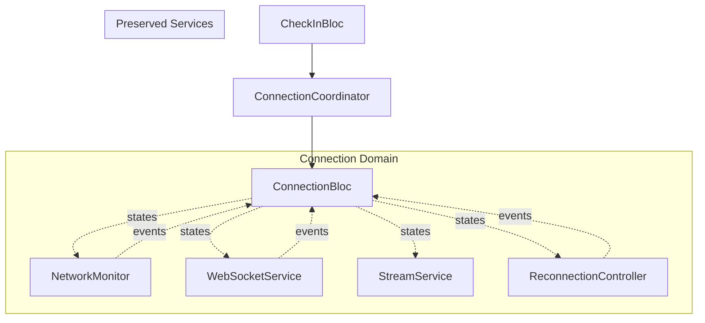

# Face Check-in Flutter - BLoC Architecture Refactoring Plan

## 🎯 Overview

Refactor current connection management system from callback-based architecture to BLoC pattern with comprehensive debug capabilities and improved state management.

## 📋 Current Problems

### 1. **Tight Coupling & Single Responsibility Violation**
- `ConnectionManager` handles too many responsibilities
- Circular dependencies between `ConnectionManager` and `ReconnectionStrategy`
- Complex internal state management with multiple state variables

### 2. **Testing Challenges**
- Hard to mock `ConnectionManager` due to multiple dependencies
- Tight coupling makes unit testing difficult

### 3. **Limited Debug Capabilities**
- No real-time status tracking
- Manual debug controls are missing
- Poor visibility into component states

## 🏗️ New Architecture: BLoC-Driven with Debug Support

### Core Architecture


## 🎯 Key Features

### 1. **Auto-Reconnection System**
- ✅ Fast retry with exponential backoff
- ✅ Background monitoring when server down
- ✅ Configurable retry parameters
- ✅ State visibility for UI

### 2. **Connection-Camera Binding**
- ✅ Camera only starts when connection established
- ✅ Auto stop camera when connection lost
- ✅ UI states for different connection phases
- ✅ Resource optimization

### 3. **Comprehensive Debug System**
- ✅ Real-time status tracking for all components
- ✅ Manual debug controls (toggle camera, websocket, streaming)
- ✅ Performance metrics and timeline tracking
- ✅ Error simulation and logging

## 📦 Component Specifications

### 1. ConnectionBloc (Core State Manager)

#### Events
```dart
@freezed
class ConnectionEvent with _$ConnectionEvent {
  // Lifecycle
  const factory ConnectionEvent.initialize() = InitializeConnection;
  const factory ConnectionEvent.dispose() = DisposeConnection;
  
  // Network Events
  const factory ConnectionEvent.networkStatusChanged({
    required bool isConnected,
  }) = NetworkStatusChanged;
  
  // WebSocket Events  
  const factory ConnectionEvent.webSocketStatusChanged({
    required WebSocketConnectionStatus status,
  }) = WebSocketStatusChanged;
  
  // Reconnection Events
  const factory ConnectionEvent.requestReconnection() = RequestReconnection;
  const factory ConnectionEvent.connectionSucceeded() = ConnectionSucceeded;
  const factory ConnectionEvent.connectionFailed({
    required String reason,
  }) = ConnectionFailed;
  const factory ConnectionEvent.switchToBackgroundMonitoring() = SwitchToBackgroundMonitoring;
  
  // Manual Actions
  const factory ConnectionEvent.requestManualRetry() = RequestManualRetry;
  
  // Debug Control Events
  const factory ConnectionEvent.debugToggleWebSocket({@Default(false) bool forceDisable}) = DebugToggleWebSocket;
  const factory ConnectionEvent.debugToggleNetworkSimulation({@Default(false) bool simulateOffline}) = DebugToggleNetworkSimulation;
  const factory ConnectionEvent.debugToggleAutoReconnect({@Default(true) bool enabled}) = DebugToggleAutoReconnect;
  const factory ConnectionEvent.debugForceReconnect() = DebugForceReconnect;
  const factory ConnectionEvent.debugClearTimeline() = DebugClearTimeline;
  const factory ConnectionEvent.debugSimulateError({required String errorType}) = DebugSimulateError;
  
  // Timeline Events
  const factory ConnectionEvent.debugAddTimelineEvent({
    required String event,
    String? details,
  }) = DebugAddTimelineEvent;
}
```

#### States
```dart
@freezed
class ConnectionState with _$ConnectionState {
  const factory ConnectionState({
    // Overall State
    @Default(AppConnectionState.disconnected) AppConnectionState appState,
    
    // Component States
    @Default(false) bool isNetworkConnected,
    @Default(WebSocketConnectionStatus.disconnected) WebSocketConnectionStatus webSocketStatus,
    
    // Reconnection State
    @Default(ReconnectionPhase.idle) ReconnectionPhase reconnectionPhase,
    @Default(0) int fastRetryAttempt,
    @Default(5) int maxFastRetries,
    @Default(false) bool isBackgroundMonitoring,
    DateTime? lastRetryAttempt,
    DateTime? nextRetryScheduled,
    
    // Auto-recovery capabilities
    @Default(true) bool autoReconnectEnabled,
    @Default(Duration(seconds: 30)) Duration backgroundCheckInterval,
    
    // Capabilities
    @Default(false) bool canStream,
    @Default(false) bool isFullyOperational,
    
    // Debug & Tracking States
    required ConnectionDebugInfo debugInfo,
    required ConnectionTimeline timeline,
    @Default(false) bool isDebugMode,
    
    // Error State
    String? errorMessage,
  }) = _ConnectionState;
}

enum ReconnectionPhase {
  idle,           // Không retry
  fastRetrying,   // Retry nhanh với exponential backoff
  backgroundMonitoring, // Kiểm tra định kỳ khi server down
  recovered,      // Đã khôi phục thành công
}
```

#### Debug Info Structure
```dart
@freezed
class ConnectionDebugInfo with _$ConnectionDebugInfo {
  const factory ConnectionDebugInfo({
    // Component States Detail
    @Default('Unknown') String networkProvider,
    @Default('N/A') String webSocketUrl,
    @Default(0) int reconnectionAttempt,
    @Default(0) int totalReconnectionAttempts,
    
    // Performance Metrics
    DateTime? lastSuccessfulConnection,
    DateTime? lastConnectionAttempt,
    Duration? connectionLatency,
    @Default(0) int messagesSent,
    @Default(0) int messagesReceived,
    
    // Error Tracking
    String? lastError,
    DateTime? lastErrorTime,
    @Default([]) List<String> recentErrors,
    
    // Manual Override States
    @Default(false) bool isManuallyDisabled,
    @Default(false) bool isWebSocketManuallyDisabled,
    @Default(false) bool isStreamingManuallyDisabled,
  }) = _ConnectionDebugInfo;
}

@freezed
class ConnectionTimeline with _$ConnectionTimeline {
  const factory ConnectionTimeline({
    @Default([]) List<TimelineEvent> events,
    @Default([]) List<StateTransition> stateTransitions,
  }) = _ConnectionTimeline;
}

@freezed
class TimelineEvent with _$TimelineEvent {
  const factory TimelineEvent({
    required DateTime timestamp,
    required String type,
    required String description,
    String? additionalInfo,
  }) = _TimelineEvent;
}

@freezed
class StateTransition with _$StateTransition {
  const factory StateTransition({
    required DateTime timestamp,
    required AppConnectionState fromState,
    required AppConnectionState toState,
    required String trigger,
    String? additionalInfo,
  }) = _StateTransition;
}
```

### 2. Enhanced CheckInBloc

#### Additional Events
```dart
@freezed
class CheckInEvent with _$CheckInEvent {
  // Existing events...
  
  // Connection-bound events
  const factory CheckInEvent.connectionStateChanged({
    required AppConnectionState connectionState,
  }) = ConnectionStateChanged;
  
  // Debug Control Events
  const factory CheckInEvent.debugToggleCamera({@Default(false) bool forceDisable}) = DebugToggleCamera;
  const factory CheckInEvent.debugToggleStreaming({@Default(false) bool forceDisable}) = DebugToggleStreaming;
  const factory CheckInEvent.debugChangeStreamingFps({required int fps}) = DebugChangeStreamingFps;
  const factory CheckInEvent.debugSimulateCameraError({required String errorType}) = DebugSimulateCameraError;
  const factory CheckInEvent.debugClearPerformanceHistory() = DebugClearPerformanceHistory;
  const factory CheckInEvent.debugToggleDebugOverlay() = DebugToggleDebugOverlay;
  
  // Performance Tracking
  const factory CheckInEvent.debugRecordPerformanceMetric({
    required double fps,
    required Duration processingTime,
    required int memoryUsage,
  }) = DebugRecordPerformanceMetric;
}
```

#### Enhanced States
```dart
@freezed
class CheckInState with _$CheckInState {
  const factory CheckInState({
    // Existing states...
    @Default(PermissionStatus.initial) PermissionStatus permissionStatus,
    @Default(CameraStatus.initial) CameraStatus cameraStatus,
    @Default(StreamingStatus.idle) StreamingStatus streamingStatus,
    
    // New: Connection-bound states
    @Default(ConnectionBoundCameraState.waitingForConnection) 
    ConnectionBoundCameraState connectionBoundCameraState,
    @Default(AppConnectionState.disconnected) AppConnectionState connectionState,
    
    // Debug States
    required CheckInDebugInfo debugInfo,
    @Default(false) bool isDebugMode,
    @Default(false) bool showDebugOverlay,
    
    // UI States
    @Default(false) bool shouldShowConnectionRequiredMessage,
    @Default(false) bool isWaitingForReconnection,
  }) = _CheckInState;
}

enum ConnectionBoundCameraState {
  waitingForConnection,  // Camera off, waiting for connection
  connecting,           // Connection in progress
  connected,           // Connection established, camera can start
  disconnected,        // Connection lost, camera stopped
}

@freezed
class CheckInDebugInfo with _$CheckInDebugInfo {
  const factory CheckInDebugInfo({
    // Camera Debug Info
    String? cameraModel,
    String? cameraResolution,
    @Default(0.0) double currentFps,
    @Default(0.0) double targetFps,
    @Default(0) int framesProcessed,
    @Default(0) int framesDropped,
    
    // Streaming Debug Info
    @Default(0) int streamingDuration, // seconds
    @Default(0) int bytesStreamed,
    DateTime? lastFrameSent,
    Duration? averageProcessingTime,
    
    // Manual Override States
    @Default(false) bool isCameraManuallyDisabled,
    @Default(false) bool isStreamingManuallyDisabled,
    
    // Performance
    @Default([]) List<PerformanceMetric> performanceHistory,
  }) = _CheckInDebugInfo;
}

@freezed
class PerformanceMetric with _$PerformanceMetric {
  const factory PerformanceMetric({
    required DateTime timestamp,
    required double fps,
    required Duration processingTime,
    required int memoryUsage,
  }) = _PerformanceMetric;
}
```

### 3. ConnectionCoordinator (Facade)
```dart
@injectable
class ConnectionCoordinator {
  final ConnectionBloc _connectionBloc;
  
  ConnectionCoordinator(this._connectionBloc);
  
  // Clean API for CheckInBloc
  Stream<AppConnectionState> get connectionStateStream => 
      _connectionBloc.stream.map((state) => state.appState).distinct();
      
  Stream<ConnectionBindingState> get bindingStateStream => 
    _connectionBloc.stream.map((state) => ConnectionBindingState(
      canStartCamera: state.appState == AppConnectionState.connected,
      shouldStopCamera: [
        AppConnectionState.disconnected,
        AppConnectionState.networkLost, 
        AppConnectionState.failed
      ].contains(state.appState),
      connectionPhase: state.appState,
      reconnectionInfo: ReconnectionInfo(
        phase: state.reconnectionPhase,
        attempt: state.fastRetryAttempt,
        maxAttempts: state.maxFastRetries,
        isBackgroundMonitoring: state.isBackgroundMonitoring,
      ),
    ));
      
  Stream<dynamic> get messageStream => _connectionBloc.messageStream;
  
  bool get canStream => _connectionBloc.state.canStream;
  bool get isFullyOperational => _connectionBloc.state.isFullyOperational;
  
  StreamService get streamService => _connectionBloc.streamService;
  
  Future<void> initialize() async {
    _connectionBloc.add(const ConnectionEvent.initialize());
  }
  
  Future<bool> requestManualRetry() async {
    _connectionBloc.add(const ConnectionEvent.requestManualRetry());
    // Return future that completes when có result
  }
  
  void dispose() {
    _connectionBloc.add(const ConnectionEvent.dispose());
  }
}

@freezed
class ConnectionBindingState with _$ConnectionBindingState {
  const factory ConnectionBindingState({
    required bool canStartCamera,
    required bool shouldStopCamera,
    required AppConnectionState connectionPhase,
    required ReconnectionInfo reconnectionInfo,
  }) = _ConnectionBindingState;
}

@freezed
class ReconnectionInfo with _$ReconnectionInfo {
  const factory ReconnectionInfo({
    required ReconnectionPhase phase,
    required int attempt,
    required int maxAttempts,
    required bool isBackgroundMonitoring,
  }) = _ReconnectionInfo;
}
```

### 4. Independent Services

#### NetworkMonitor (Extract from NetworkConnectivityService)
```dart
@injectable
class NetworkMonitor {
  final _statusController = StreamController<bool>.broadcast();
  Stream<bool> get statusStream => _statusController.stream;
  
  bool get isConnected => // current status
  
  Future<void> initialize() async {
    // Setup network monitoring
    // Emit events to stream
  }
  
  void dispose() {
    _statusController.close();
  }
}
```

#### ReconnectionController (Independent)
```dart
class ReconnectionController {
  final ReconnectionConfig _config;
  
  // Internal state
  ReconnectionPhase _phase = ReconnectionPhase.idle;
  Timer? _retryTimer;
  int _retryCount = 0;
  
  // Output stream
  final _stateController = StreamController<ReconnectionState>.broadcast();
  Stream<ReconnectionState> get stateStream => _stateController.stream;
  
  // Input: Methods called from ConnectionBloc
  void handleNetworkLost() { /* logic */ }
  void handleNetworkRestored() { /* logic */ }
  void handleConnectionFailure() { /* logic */ }
  void handleConnectionSuccess() { /* logic */ }
  
  // Self-contained reconnection logic
  Future<bool> performReconnection() async {
    // Return success/failure
    // ConnectionBloc will listen to result and update state accordingly
  }
  
  void dispose() {
    _stateController.close();
  }
}
```

### 5. Debug System

#### Debug Logger
```dart
class DebugLogger {
  static final List<DebugLogEntry> _logs = [];
  static final StreamController<DebugLogEntry> _logController = StreamController.broadcast();
  
  static Stream<DebugLogEntry> get logStream => _logController.stream;
  static List<DebugLogEntry> get allLogs => List.unmodifiable(_logs);
  
  static void log(String component, String message, {DebugLogLevel level = DebugLogLevel.info}) {
    final entry = DebugLogEntry(
      timestamp: DateTime.now(),
      component: component,
      message: message,
      level: level,
    );
    
    _logs.add(entry);
    if (_logs.length > 100) _logs.removeAt(0); // Keep only recent 100 logs
    
    _logController.add(entry);
    
    // Also print to console in debug mode
    if (kDebugMode) {
      print('[${entry.level.name.toUpperCase()}] ${entry.component}: ${entry.message}');
    }
  }
  
  static void connectionLog(String message) => log('CONNECTION', message);
  static void cameraLog(String message) => log('CAMERA', message);
  static void streamLog(String message) => log('STREAM', message);
  static void performanceLog(String message) => log('PERFORMANCE', message);
}

enum DebugLogLevel { debug, info, warning, error }

@freezed
class DebugLogEntry with _$DebugLogEntry {
  const factory DebugLogEntry({
    required DateTime timestamp,
    required String component,
    required String message,
    required DebugLogLevel level,
  }) = _DebugLogEntry;
}
```

#### Debug UI Components
- `DebugControlPanel`: Manual controls for all components
- `StatusMonitorWidget`: Real-time status display
- `DebugLogsWidget`: Log viewer with filtering
- `DebugFloatingButton`: Entry point for debug features

## 🚀 Implementation Strategy

### Phase 1: Foundation Setup (Week 1)
1. ✅ Create BLoC events and states structures
2. ✅ Set up Freezed models for all states
3. ✅ Create basic ConnectionBloc shell
4. ✅ Set up DebugLogger infrastructure

**Files to create:**
- `lib/core/connection/models/connection_models.dart`
- `lib/core/connection/bloc/connection_bloc.dart`
- `lib/core/connection/bloc/connection_event.dart`
- `lib/core/connection/bloc/connection_state.dart`
- `lib/core/debug/debug_logger.dart`

### Phase 2: Extract Independent Services (Week 2)
1. ✅ Extract NetworkMonitor from NetworkConnectivityService
2. ✅ Refactor ReconnectionController to be independent
3. ✅ Update WebSocketService to emit events
4. ✅ Preserve StreamService (minimal changes)

**Files to modify:**
- `lib/core/services/connection/network_monitor.dart` (new)
- `lib/core/services/connection/reconnection_controller.dart` (refactor)
- `lib/core/services/websocket_service.dart` (update)
- `lib/core/services/stream_service.dart` (preserve)

### Phase 3: Implement ConnectionBloc Core Logic (Week 3)
1. ✅ Implement ConnectionBloc event handlers
2. ✅ Set up service subscriptions and event mapping
3. ✅ Implement state calculation logic
4. ✅ Add auto-reconnection with background monitoring

**Key implementations:**
- Fast retry with exponential backoff
- Background monitoring when server down
- State aggregation from multiple sources
- Timeline and debug info tracking

### Phase 4: Create ConnectionCoordinator (Week 4)
1. ✅ Create facade layer for clean API
2. ✅ Implement connection-camera binding logic
3. ✅ Set up cross-BLoC communication
4. ✅ Test integration with existing CheckInBloc

**Files to create:**
- `lib/core/connection/connection_coordinator.dart`

### Phase 5: Update CheckInBloc (Week 5)
1. ✅ Replace ConnectionManager dependency with ConnectionCoordinator
2. ✅ Implement connection-camera binding
3. ✅ Add debug events and states
4. ✅ Test camera auto-start/stop functionality

**Key features:**
- Camera only starts when connection established
- Auto-stop camera when connection lost
- Debug controls for manual override

### Phase 6: Debug UI Implementation (Week 6)
1. ✅ Create debug control panels
2. ✅ Implement real-time status monitoring
3. ✅ Add debug floating button
4. ✅ Create log viewer interface

**Files to create:**
- `lib/features/check_in/widgets/debug/debug_control_panel.dart`
- `lib/features/check_in/widgets/debug/status_monitor_widget.dart`
- `lib/features/check_in/widgets/debug/debug_logs_widget.dart`
- `lib/features/check_in/widgets/debug/debug_floating_button.dart`

### Phase 7: Testing & Integration (Week 7)
1. ✅ Write unit tests for all BLoCs
2. ✅ Write integration tests for cross-BLoC communication
3. ✅ Test debug features thoroughly
4. ✅ Performance testing and optimization

### Phase 8: Cleanup & Migration (Week 8)
1. ✅ Remove old ConnectionManager
2. ✅ Remove old ReconnectionStrategy
3. ✅ Update dependency injection
4. ✅ Documentation and final testing

**Files to remove:**
- `lib/core/services/connection/connection_manager.dart`
- `lib/core/services/connection/reconnection_strategy.dart`

## 🎯 Success Criteria

### Functional Requirements
- ✅ Auto-reconnection with exponential backoff
- ✅ Background monitoring when server down
- ✅ Connection-camera binding (camera only starts when connected)
- ✅ Manual debug controls for all components
- ✅ Real-time status tracking

### Technical Requirements
- ✅ Loose coupling between components
- ✅ Testable architecture (>90% test coverage)
- ✅ Type-safe event-driven communication
- ✅ Preserved WebSocketService and StreamService functionality
- ✅ Comprehensive debug and monitoring capabilities

### Performance Requirements
- ✅ No regression in connection performance
- ✅ Efficient resource usage (camera stops when not needed)
- ✅ Responsive UI during connection state changes

## 📁 File Structure Changes

### New Files
```
lib/
├── core/
│   ├── connection/
│   │   ├── bloc/
│   │   │   ├── connection_bloc.dart
│   │   │   ├── connection_event.dart
│   │   │   ├── connection_state.dart
│   │   │   └── connection_bloc.freezed.dart
│   │   ├── models/
│   │   │   └── connection_models.dart
│   │   ├── connection_coordinator.dart
│   │   └── network_monitor.dart
│   ├── debug/
│   │   ├── debug_logger.dart
│   │   └── debug_models.dart
│   └── services/
│       └── connection/
│           └── reconnection_controller.dart (refactored)
└── features/
    └── check_in/
        └── widgets/
            └── debug/
                ├── debug_control_panel.dart
                ├── status_monitor_widget.dart
                ├── debug_logs_widget.dart
                └── debug_floating_button.dart
```

### Modified Files
```
lib/
├── core/
│   ├── di/
│   │   ├── di.dart (update injections)
│   │   └── di.config.dart (regenerate)
│   └── services/
│       ├── websocket_service.dart (minor updates)
│       └── stream_service.dart (preserved)
└── features/
    └── check_in/
        ├── bloc/
        │   ├── check_in_bloc.dart (major refactor)
        │   ├── check_in_event.dart (add debug events)
        │   └── check_in_state.dart (add debug states)
        └── screens/
            └── check_in_screen.dart (add debug UI)
```

### Removed Files
```
lib/core/services/connection/
├── connection_manager.dart (replaced by ConnectionBloc + Coordinator)
└── reconnection_strategy.dart (replaced by ReconnectionController)
```

## 🔧 Dependencies

### New Dependencies (if needed)
```yaml
dependencies:
  # Existing dependencies remain
  
dev_dependencies:
  # For enhanced testing
  bloc_test: ^9.1.0
  mocktail: ^1.0.0
```

## 📝 Notes

### Preserved Components
- **WebSocketService**: Functionality preserved, minimal changes for event emission
- **StreamService**: Preserved as-is, only integration changes for ConnectionCoordinator
- **CheckInBloc core logic**: Camera and streaming logic preserved, only connection handling changes

### Migration Strategy
- Gradual migration with old system running in parallel during development
- Feature flags for debug system (can be disabled in production)
- Backward compatibility maintained until full migration

### Testing Strategy
- Unit tests for each BLoC independently
- Integration tests for cross-BLoC communication
- Widget tests for debug UI components
- End-to-end tests for full connection flow

---

*This plan provides a comprehensive roadmap for migrating to a more maintainable, testable, and feature-rich architecture while preserving existing functionality and adding powerful debug capabilities.* 